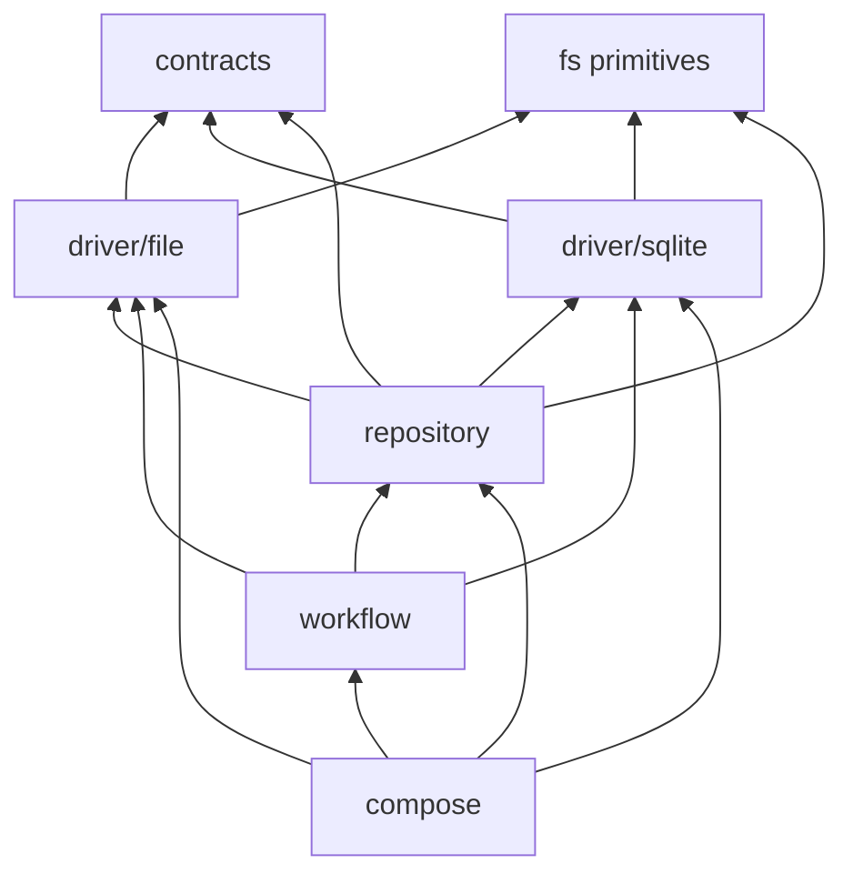

# Architecture

Orbit is a Rust workspace of layered crates. **Lower layers never depend on higher ones.** [`scripts/check-dependency-direction.sh`](scripts/check-dependency-direction.sh) enforces every crate edge, so a new edge means updating that script and the table below in the same PR.

```text
Surfaces      orbit-cli · orbit-web · orbit-mcp
Composition   orbit-cmd
Application   orbit-core
Domain        orbit-engine · orbit-automation · orbit-agent · orbit-tools · orbit-store
              orbit-search · orbit-registry · orbit-config
Kernel        orbit-exec · orbit-policy
Foundation    orbit-common · orbit-types
```

Domain crates own their data and transport. Application layers compose them. Kernel crates expose reusable mechanisms and never depend back on a feature.

## Crates

| Crate | Tier | Depends on (internal) |
|---|---|---|
| `orbit-types` | stable | — |
| `orbit-common` | stable | types |
| `orbit-config` | internal | common, types |
| `orbit-policy` | internal | common, types |
| `orbit-exec` | internal | common, types |
| `orbit-search` | internal | common, types |
| `orbit-store` | stable | common, types |
| `orbit-registry` | internal | common, config, types |
| `orbit-tools` | internal | common, exec, policy, types |
| `orbit-agent` | internal | common, tools, types |
| `orbit-automation` | internal | common, store, types |
| `orbit-engine` | internal | agent, common, exec, store, tools, types |
| `orbit-mcp` | internal | common, registry, tools, types |
| `orbit-core` | internal | automation, common, config, engine, policy, search, store, tools, types (dev: exec) |
| `orbit-cmd` | internal | common, config, core, engine, mcp, registry, store, tools, types |
| `orbit-web` | internal | cmd, common, core, registry, types |
| `orbit-cli` | internal | cmd, common, config, core, mcp, registry, types, web |

The `orbit-core` → `orbit-exec` edge is dev-only for Linux sandbox regression
tests; production Core does not depend on Exec. The dependency-direction guard
also checks that dependencies defined in `[workspace.dependencies]` are inherited
in member manifests with `workspace = true`.

### Foundation and kernel

- **orbit-types** holds shared serde contracts, pure constructors, and narrow domain errors, organized as domain modules (`identity`, `workspace`, `task`, `workflow`, …). It does no I/O of any kind. Its serde shapes are persisted contracts.
- **orbit-common** holds `OrbitError` and the shared mechanisms: filesystem and path helpers, process support, storage, UTF-8-safe text bounds, protocol and YAML codecs, observability, and security. Security covers the release signing keys and verification used by `orbit update`, redaction, and `security::child_env`, the single allowlist builder for agent-subprocess environments. Operation registries live here so every surface can read them. The matching handlers live in `orbit-core`.
- **orbit-policy** resolves `FsProfile` and evaluates `denyRead` and `denyModify` rules.
- **orbit-exec** provides process, sandbox, and supervision primitives for commands run under an `FsProfile`.

### Domain

- **orbit-config** owns `config.toml`. That covers the key registry, global-over-workspace layering (security keys replace rather than merge, and `[machine]` is global-only), provenance for `orbit config show`, resolved views, and comment-preserving atomic edits through `ConfigStore`. Callers pass explicit roots, so the crate never discovers the cwd or `$HOME`. It does not depend on `orbit-engine`; Core translates PR settings at composition time.
- **orbit-search** runs lexical retrieval. It owns the SQLite chunk and FTS5 schema, chunking, task-field extraction, and BM25 ranking. Core projects task records into it. The index file keeps its `semantic.db` name so persisted paths stay compatible.
- **orbit-registry** owns this machine's `[machine]` identity, the workspace catalog, checkout bindings, and task-publication bindings, each persisted atomically. It has no shared database and no runtime execution.
- **orbit-store** handles persistence. See [orbit-store internals](#orbit-store-internals) below.
- **orbit-tools** holds the tool registry and the built-in fs, exec, and Orbit tool definitions. It loads and runs `plugin.yaml` v2 plugins through an `exec` backend (one confined process per call) or an `mcp` backend (a stdio server per caller context). Both backends run under the operator's granted sandbox profile. Plugin lifecycle (install, enable, grants, `.orbit/plugins.yaml`) belongs to Core. This crate is also the only owner of the `gh` CLI contract.
- **orbit-agent** provides one `AgentRuntime` per provider CLI (claude, codex, copilot, cursor, gemini, antigravity, grok, pi, and others). It also contains a standalone HTTP agent-loop SDK, which Orbit's own job execution does not use.
- **orbit-engine** executes activities and jobs: template rendering, retries, subprocess and tool-aware automation, and the CLI agent runner. It references `orbit-agent` directly, so Core stays free of agent types. It also owns candidate identity, reviewer repair commits, and the reviewed-head rechecks in `pr_open` and `pr_complete`.
- **orbit-automation** is the scheduling domain for routines and auto-tasks. It covers definition validation, due evaluation, overlap and retry, coverage acceptance, and state-triggered consumers. Its `review` module owns the before-PR coverage rules. It never depends on Core or Engine and has no loop or store of its own. Store owns cursors, claims, and receipts.

### Application and surfaces

- **orbit-core** composes the runtime. Its internal graph is `runtime ← application ← adapter`, with `composition` as the only module that joins config, bootstrap, runtime, and adapters. It exposes `OrbitRuntime` and never depends on `orbit-agent`, `orbit-cmd`, or transport crates. Notable application modules:
  - `review` runs the before-PR review gate (admit, settle, certificates, landing verification).
  - `landing` is the owner-side landing consumer for distributed drains, dispatched from the coordination outbox.
  - `config` projects `orbit-config` as structured data for the dashboard. Writes go through the same `ConfigStore`.
- **orbit-cmd** composes the application for the CLI and web. It joins Core to Registry and holds command groups, runtime assembly, routines, and managed-worker transports. `update` is the one group that composes outward: it handles release download, integrity checks, binary replacement, and post-install convergence.
- **orbit-mcp** implements the MCP transport over `rmcp`: stdio and TCP transports, tool discovery, per-call traces, the SSH stdio proxy, and the federated mux, which routes host-qualified `hm_*/ws_*` selectors and fails closed. Core owns validation and auditing.
- **orbit-web** serves the HTTP API and embedded dashboard, plus `web connect` over an SSH tunnel.
- **orbit-cli** is the clap entry point and client configuration. It assembles MCP, Registry, Web, and Core. The accepting machine always resolves its own state and dispatches through Core.

## orbit-store internals



- **`contracts`** holds every consumer-visible trait and DTO. Application code uses only these.
- **`driver/file`** and **`driver/sqlite`** are private, implement one technology each, and never import each other. Shared atomic-write, lock, path-safety, and YAML code lives in `fs`.
- **`repository`** enforces invariants that span drivers. A task write, for example, is a canonical bundle plus registry rows. Task and reservation changes commit through one boundary ([pattern](docs/design-patterns/task_commit_boundary.md)).
- **`workflow`** holds the explicit import, export, reindex, repair, publication, and layout-upgrade operations. Nothing imports implicitly on open.
- **`compose`** builds the concrete stores. Construction and migrations stay in composition, bootstrap, and maintenance code.

The dependency-direction script enforces these arrows too.

## Stability tiers

Each crate declares `stability` under `[package.metadata.orbit]` in its `Cargo.toml`. [`scripts/check-stability.sh`](scripts/check-stability.sh) fails if the marker is missing or invalid. There is no automated API diff; the tier signals refactor scope to reviewers.

- **stable**: breaking changes need owner sign-off.
- **experimental**: free to refactor, and downstream depends at its own risk.
- **internal**: refactor freely.

## Scoping rules

Orbit has two roots: global `~/.orbit/` and the workspace `.orbit/`.

| Artifact | Strategy | Notes |
|---|---|---|
| Tasks, job runs, run traces | Workspace only | Per-repo backlog and execution artifacts |
| Search index | Workspace only | Lexical task index |
| Activities, jobs, skills | Merge by key | Global defaults, workspace overrides by name |
| Policies | Merge by key | Workspace overrides profiles; global deny rules accumulate |
| Command audit | Global only | One authoritative SQLite trail |
| Global defaults stamp | Global only | Lets a warm open skip re-hashing managed catalogs |

## Automation persistence

- Automation state (consumer checkpoints, delivery-owner intents, accepted coverage, and recovery records) lives in the host SQLite store's feature migrations. Every checkpoint and receipt change is generation-fenced. Recovery never moves a cursor, drops an obligation, or mints a receipt.
- Task action keys live with task allocation in the registry, and job keys commit with job admission.
- Task artifacts reserve `automation-evidence-authority.json` for transport-supplied run origin plus a digest. Neither a model nor caller JSON can create that authority. Source ranges are retained under `refs/orbit/automation/...` until explicit cleanup.

## Product identity

Orbit is the only supported application profile. A `.orbit-product` marker, checked in [`bootstrap::product_profile`](crates/orbit-core/src/bootstrap/product_profile.rs), stops another product from initializing or reconciling an Orbit root. Unmarked legacy roots still open. The marker guards against accident, not attack. A test-only fixture shows the runtime can be reused without the engineering assets.

Before a second public profile can exist, it must be fixed before state opens and carried through every entry point, not just filtered in tool discovery. That means these entry points:
- tool execution and command dispatch
- engine and Core dispatchers
- job submission and web run handlers
- the MCP and federated servers
- detached workers
- agent callbacks
- clock installation
