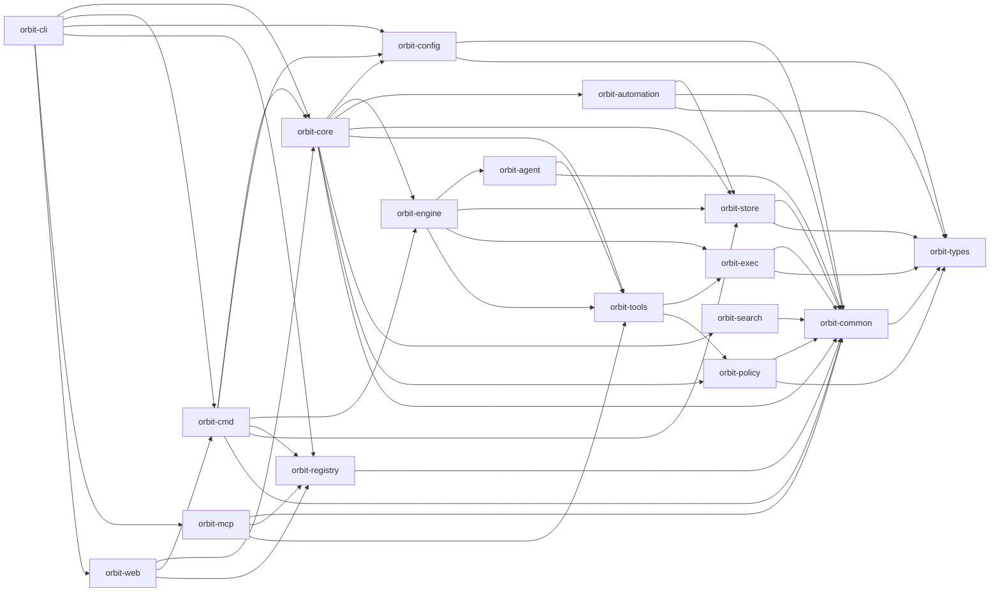
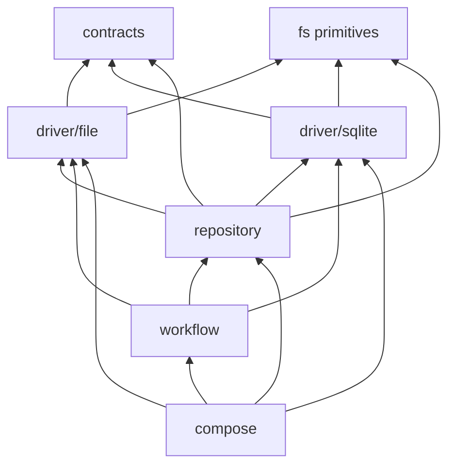

# Architecture

Layered Rust crates. Lower layers do not depend on higher layers.

The diagram highlights the dependency edges that define the principal layering
boundaries; [`scripts/check-dependency-direction.sh`](scripts/check-dependency-direction.sh)
is the exhaustive crate-edge contract.

Layering constrains dependency direction. Domain crates own their data and
transport concerns; application layers compose them with runtime kernels.
Kernel crates expose reusable mechanisms and never depend back on a vertical
feature.

---

## Crates

- **orbit-types**: lowest internal contract crate — no Orbit deps. Domain-qualified modules (`identity`, `workspace`, `task`, `workflow`, `policy`, `resource`, `tool`, `telemetry`, `record`) own shared serde contracts, pure constructors, normalization, and narrow domain errors. `OrbitId` is the only crate-root primitive. This crate does not perform filesystem, process, environment, database, network, logging, or tracing work.
- **orbit-common**: mechanism crate above `orbit-types`. Owns workspace-wide `OrbitError`, governance (`authorization`, `operation`, `friction`), filesystem/path helpers, process support, storage, protocol/YAML codecs, observability, and security (release-artifact trust in `security::release` — the one Rust copy of the release signing key set and its signature/checksum verification, shared by `orbit update` and `orbit semantic install`; redaction; plus `security::child_env`, the single
  allowlist-based builder for agent-subprocess environments that `orbit-config`
  parameterizes with `[execution.env]` and every subprocess launcher applies to a
  cleared environment). Operation registries still live here so every consumer surface can read them without a new dependency edge; the matching handler table lives in `orbit-core` and is joined to it by the noun's verb enum. MCP v1 explicitly defers capability decisions inside Core while retaining ordinary domain and sandbox validation.
- **orbit-config**: owner of `config.toml`. Fixed-key admission registry, global-over-workspace layering with replace-only security keys, source provenance for `orbit config show`/`get`, resolved views (`ResolvedConfig`, execution/env policies, crew registry, persistence paths, config-owned PR settings), comment-preserving `ConfigStore` edits with atomic save, and default-config seeding. Callers pass an explicit `ConfigRoots`, so the crate performs no cwd or `$HOME` discovery; host provider-CLI detection and interactive prompting stay in the `orbit-cli` init adapter, which hands down a `ConfigSeed`. Depends only on `orbit-types` and `orbit-common`, and deliberately not on `orbit-engine` — Core translates `PrSettings` into `orbit_engine::PrConfig` at composition time.
- **orbit-policy**: filesystem-scoping policy engine. Owns `FsProfile` resolution and `denyRead` / `denyModify` evaluation. Depends on `orbit-types` and `orbit-common`.
- **orbit-exec**: process / sandbox / supervision primitives for shell-command execution under an `FsProfile`. Depends on `orbit-types` and `orbit-common`.
- **orbit-search**: retrieval and ranking feature crate. Owns lexical docs/ADR scoring, the `Embedder` trait, JSON-Lines RPC types, `SubprocessEmbedder`, `NoopEmbedder`, the workspace-local vector store (`vector::VectorStore` with its own `rusqlite::Connection`, WAL + busy_timeout pragmas, idempotent `embeddings` / `chunks` / `corpus_fts` schema, `EmbedWorker`, paragraph chunker, BLAKE3 dedup, BM25, cosine, and reciprocal-rank fusion helpers), and the install/uninstall/reindex/stats `commands::*` surface. Depends on `orbit-types` and `orbit-common` for its library surface; does not depend on `orbit-core` or `orbit-store`.
  Retrieval and ranking live in `orbit-search`. `orbit-core` owns the domain (corpora, records, lifecycle) and projects records into search-source structs. `orbit-search` owns lexical (BM25), semantic (cosine), and hybrid scoring. CLI verbs are presets layered on the same backend.
  It also builds `orbit-search-companion`, a separately installed search companion binary, as an additional `[[bin]]` target (folded from the standalone `orbit-search-companion` crate, ORB-10357); that target alone depends on fastembed-rs and is not linked into the default `orbit` CLI binary.
- **orbit-registry**: machine identity and workspace registry feature crate. It
  owns `host.toml`, the logical workspace catalog, local checkout bindings,
  owner-local task-publication repository bindings, validation, and atomic file
  persistence. It contains no shared database, command orchestration, MCP
  transport, or Core runtime execution. Depends only on `orbit-types` and
  `orbit-common` among workspace crates.
- **orbit-store**: one directional persistence crate. `contracts` owns every
  consumer-visible trait, parameter, query/filter, and result projection;
  `fs` owns narrowly named lock, path-safety, and YAML mechanics; private
  `driver/file` and `driver/sqlite` modules implement exactly one persistence
  technology each. `repository` owns live invariants that join drivers (task
  bundles + registry allocation/index rows, and friction SQLite + file
  taxonomy). `workflow` owns explicit import/export/reindex/repair,
  owner-only task-publication transport, read-only task-publication
  inspection, and layout-upgrade operations.
  `compose` constructs concrete implementations and
  returns contract-facing stores. The crate retains the namespaced feature
  migration ledger and immutable historical bootstrap migrations. It depends
  on `orbit-types` and `orbit-common`; the semantic vector schema remains owned
  by `orbit-search::vector`.
- **orbit-tools**: generic tool registry plus built-in fs, policy-aware exec, and workspace-scoped Orbit definitions. It depends on `orbit-types`, `orbit-common`, `orbit-exec`, and `orbit-policy`; MCP composes these with its machine-local discovery definitions. It is also the single owner of the GitHub CLI contract: `github_cli` re-exports the `gh` argv builders, JSON projections, and bounded/redacted log helpers so `orbit-engine`'s host-owned CI evidence collection runs the same queries as the `github.*` tools without a second copy of them and without routing through `ToolRegistry`.
- **orbit-mcp**: Model Context Protocol feature crate using `rmcp`. It owns stdio framing, advertised-name translation, per-call trace creation, structured responses, canonical tool discovery, server identity presentation, the TCP listener transport, the direct SSH stdio proxy, destination-side caller authorization (including machine-global `mcp-callers.toml` and hashed `mcp-ssh-acceptance/` forced-command capabilities), and the federated mux (`FederatedMcpHost`: implicit local membership plus operator-configured SSH remotes, live list, fail-closed host-qualified routing). Registry supplies machine-local facts and Tools supplies definitions whose only routing metadata is global versus workspace-required scope. The CLI-owned `ServerMcpHost` resolves server-local workspaces and is the in-process destination for local federated selectors. The federated host advertises that callers copy `selector` from federated `orbit.workspace.list` and routes a copied `hm_*/ws_*` selector to the encoded destination — locally without SSH, otherwise over the configured remote. Core owns domain validation and auditing behind the session envelope.
- **orbit-web**: HTTP API, embedded dashboard UI, and remote web connection. It owns axum handlers/assets, dashboard mutations, and the dashboard-specific SSH local-forward lifecycle. Depends on `orbit-core` for runtime-backed operations and projections and on `orbit-registry` for global workspace discovery; consumed by `orbit-cli` via `web serve` and `web connect`. Public surface is `ServeArgs`, `ConnectArgs`, and their serve/connect entry points.
- **orbit-agent**: per-provider `AgentRuntime` implementations under `providers/<name>/<name>_runtime.rs` (claude, codex, copilot, cursor, gemini, antigravity, gemini_http, grok, openai_compat, anthropic, ollama, pi, mock_agent). Provides the CLI agent runtimes Orbit dispatches, plus a standalone HTTP `LoopTransport` / `AgentLoop` SDK surface with its own examples — Orbit's job execution no longer reaches that loop ([ORB-10801]). Depends on `orbit-types`, `orbit-common`, and `orbit-tools`.
- **orbit-engine**: activity/job execution, template rendering, retry logic, subprocess execution, and tool-aware automation. Owns the CLI agent subprocess runner (`activity_job::cli_runner`), which references `orbit-agent::{Agent, AgentConfig}` directly so orbit-core stays clean of orbit-agent types. Depends on `orbit-agent`, `orbit-types`, `orbit-common`, `orbit-exec`, `orbit-store`, and `orbit-tools`.
- **orbit-automation**: internal scheduling domain for routines and auto-tasks [ORB-11330]. Owns definition discovery/validation, due evaluation, overlap/retry coordination and coverage acceptance. State consumers [ORB-11331] own material fingerprints and causal incident rules in `members`; Core supplies bounded task/run/source facts and adapts existing pilot/triage prepare and apply. State members reuse the Store consumer/coverage transaction and action-key admission, with no Core checkpoint or eligibility copy. Core supplies explicit sources, catalog resolution, authority and task/job lifecycle adapters; Store owns cursors, claims and receipts. Depends only on Store, Common and Types; never Core or Engine. Uses the existing sweep entry points, with no ticking loop or independent persistence store. Operation mode [ORB-11332] supplies the evaluator resolved `MemberConstraints` (grant scope and due interval) through the Core state adapter; the evaluator, fingerprint, and checkpoint paths are not duplicated, and Automation never reads grants. The `review` module [ORB-11333] owns the shared before-PR coverage rules (task-meaning digest, certificate acceptance, exact-tree exclusion, landing classification); the delivery evaluator applies exclusions for review consumers only. Automation never persists review evidence.
- **orbit-core** `application/review` [ORB-11333]: composes the before-PR review gate over the existing PR pipeline. It captures the effective review policy into delivery run input at submission (children inherit; grant-bound runs use the captured grant policy), runs the `review_gate_admit` / `review_gate_settle` deterministic actions (reviewer crew resolution inside the run allowlist, ledger reservation, manifest and certificate artifacts, honest verdicts, escalation), verifies managed landings after completion, and feeds proven exclusions to the shared delivery evaluator. `orbit-automation::review` owns the task-meaning digest, certificate acceptance, exclusion, and landing classification rules; Store owns lineage ledgers, immutable certificates, and landing records (`ReviewStoreBackend`); Engine owns candidate identity collection, reviewer-attributed repair commits, and the reviewed-head rechecks in `pr_open` / `pr_complete`. There is no second validator, cursor, or scheduler.
- **orbit-core** `application/operation` [ORB-11332]: composes operation-mode authority over existing pipelines. `orbit-config` resolves `[operation]` preferences with provenance; Core validates and captures grants, rechecks them at the drain classifier, the child-admission path, promotion, recovery reservation, and the guarded completion transition; Store persists grants and per-task recovery ledgers and rechecks grant validity, scope, task claims, and leaf capacity inside the existing child-admission transaction; Engine only asks the host before dispatching a recovery hook and before `review -> done`. There is no second scheduler or policy engine.
- **orbit-core**: directional application/runtime composition and metrics. Its
  `runtime` module owns stores, eventing, audit, claims, reservations, tool and
  process execution mechanisms, and construction from an already-resolved
  `orbit-config` value. `application` owns shared use-case DTOs and coordinated
  operations. `adapter` owns Orbit-tool and engine-host protocol translation;
  `bootstrap` owns initialization, managed defaults, policy seeding, and
  forward-only startup migrations; `composition` is the only module that joins
  those pieces and loads resolved configuration. The enforced internal graph is
  `runtime <- application <- adapter`, with `composition -> config + bootstrap
  + runtime + adapters`. Runtime production code may not import `application`
  or a former `command` module, and application production code may not import
  adapters. Core exposes `OrbitRuntime` to `orbit-cmd`, `orbit-cli`, and
  `orbit-web`; it does not depend on transport/presentation crates,
  `orbit-agent`, or `orbit-cmd`.
- **orbit-cmd**: shared application composition for CLI and Web consumers. It owns CLI-facing command groups plus registry-aware runtime and routine assembly, joining `orbit-core` kernels to `orbit-registry` without reversing either lower-layer dependency. `update` is the one group that composes outward instead of downward: it owns install-channel detection, release download and integrity, executable replacement, and the post-replacement convergence the *newly installed* binary performs as a subprocess. Runtime methods are exposed as per-module `*Commands` extension traits.
- **orbit-cli**: clap-based entry point and local client-configuration surface. It assembles MCP, Registry, Web, and Core. `mcp serve` and `mcp listen` compose one host and serve it over stdio or TCP; `mcp serve --mode remote` delegates only the byte-transparent SSH process to `orbit-mcp`. In every case the accepting machine resolves local state and dispatches through Core.

---

## orbit-store internal direction

The file and SQLite drivers are private and never import one another. Shared
atomic-write, advisory-lock, path-safety, and YAML mechanics belong to `fs`,
not to a backend-shaped utility module. Canonical task bundles and workspace
binding YAML are file behavior even though registry rows are SQLite-backed.

Live task writes are committed by the composite task repository: a canonical
bundle write plus registry allocation/binding/index rows. The drivers do not
call each other. Task archive
import/export/reindex, owner-only task-publication transport and its read-only
inspection, friction Markdown import/SQLite export, legacy audit and job-run
import, and workspace layout upgrades are explicit `workflow` modules.
In particular, constructing a friction repository does not perform a hidden
Markdown import; `compose::workspace_friction_store` invokes the idempotent,
transactional workflow before opening the live repository.

[`scripts/check-dependency-direction.sh`](scripts/check-dependency-direction.sh)
enforces these source-level arrows in addition to crate-level edges. It rejects
implementation or `rusqlite` imports from contracts, cross-driver imports, and
driver imports of repositories/workflows. Concrete construction and migration
access stay in composition, bootstrap, and maintenance adapters; ordinary
application code consumes the contract traits and DTOs.

---

## Stability tiers

Each workspace crate declares a stability tier in its `Cargo.toml` under `[package.metadata.orbit]`. `scripts/check-stability.sh` (wired into `make ci`) fails closed if a crate is missing the marker or sets a value outside the allowed set. The current contract is marker-only — no automated public-API diff — but the tiering exists to make refactor scope explicit for reviewers.

- **stable** — Public-ish surface. Breaking changes need conscious owner sign-off. (No automated diff today; this is intent-signalling only.)
- **experimental** — Free to refactor; downstream crates depend at their own risk.
- **internal** — Refactor freely; no external/downstream guarantees.

| Crate                 | Tier         |
|-----------------------|--------------|
| orbit-types           | stable       |
| orbit-common          | stable       |
| orbit-config          | internal     |
| orbit-store           | stable       |
| orbit-registry        | internal     |
| orbit-agent           | internal     |
| orbit-cli             | internal     |
| orbit-cmd             | internal     |
| orbit-core            | internal     |
| orbit-automation      | internal     |
| orbit-search           | internal     |
| orbit-engine          | internal     |
| orbit-exec            | internal     |
| orbit-mcp             | internal     |
| orbit-web             | internal     |
| orbit-policy          | internal     |
| orbit-tools           | internal     |

---

## Automation persistence [ORB-11330]

Cmd runtime composition supplies the registry-derived stable machine identity to
Core. Enabled delivery definitions explicitly select that owner before baselining
or admission; Core does not acquire a Registry dependency.

Automation uses the existing host SQLite Store feature migration for consumer
state, delivery-owner intents and accepted coverage; task action keys live with
allocation in the existing task registry, and job keys are committed alongside
ordinary job admission. All checkpoint/receipt changes are generation-fenced.
The auxiliary task-key table preserves the v5 task/allocator format so older
readers can ignore it during rollback. Accepted receipt bytes are immutable and
independent of later artifact replacement.

Task artifacts retain their existing bundle/manifest format. The artifact Store
reserves `automation-evidence-authority.json`, writing transport-supplied run
origin and a digest alongside coverage bytes under the existing task lock.
Neither model attribution nor caller-supplied JSON creates that authority. Core
checks the owner run's task assignment and the frozen source range; Automation
owns acceptance rules. The checkoutless hub supplies provenance without loading
an owner checkout. Source retention uses `refs/orbit/automation/...` in the
existing Git object store; these refs stay until explicit retention cleanup.

Operation-mode grants and recovery ledgers [ORB-11332] live in the host SQLite
store under the `operation` feature migration (`operation_grants`,
`operation_recovery`). A grant is the durable authorization record; run inputs
carry only the captured admission snapshot under the reserved `operation` key,
which the grant-bound coordinator writes and children inherit at the
parent-authorized admission path. Older binaries ignore both tables.

## Scoping Rules

| Artifact        | Strategy           | Rationale                                        |
|-----------------|--------------------|--------------------------------------------------|
| Tasks           | WorkspaceOnly      | Per-repo backlog, no cross-project leaking       |
| Activities/Jobs | MergeByKey         | Global defaults + workspace overrides            |
| Policies        | MergeByKey         | Workspace overrides profiles by name; global `denyRead` / `denyModify` rules accumulate |
| Job Runs        | WorkspaceOnly      | Execution artifacts are workspace-local          |
| Skills          | MergeByKey         | Global defaults in `~/.orbit/skills`; workspace overrides by skill name |
| Command Audit   | GlobalOnly         | Single authoritative SQLite event trail          |
| Semantic Index  | WorkspaceOnly      | Task-derived embeddings stay with the workspace  |
| Run Traces      | WorkspaceOnly      | Per-repo activity/job JSONL and blob artifacts   |
| Global Defaults Stamp | GlobalOnly   | `<global root>/resources/.orbit-global-defaults.json` names the embedded default set last reconciled into that root, so a warm runtime open skips re-reading and re-hashing the managed catalogs |
| ADR/Learning IDs | Shared allocator + worktree-local bodies | ID rows live in shared `.orbit/state/semantic.db`; body files live in the current worktree so they can be staged with code |
