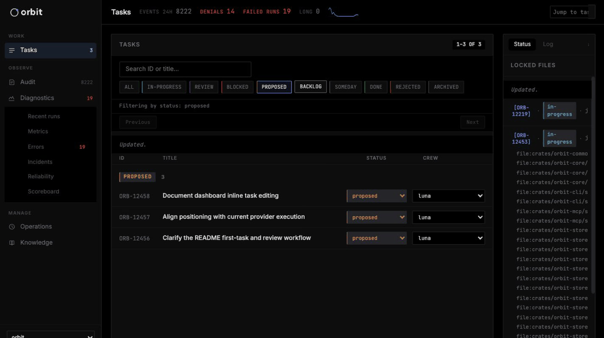

# Orbit — Your agent files the work. Orbit ships it. You review the pull request.

<p align="center">
  
</p>

<p align="center">
  <em>The Orbit dashboard (<code>orbit web serve</code>) — task backlog, live audit log, per-agent scoreboard.</em>
</p>

**Say what you want in the coding agent you already use. Over MCP it files a task with acceptance criteria, Orbit runs it in an isolated worktree with the task's file scope reserved and a gated pipeline, and a pull request comes back for you to review. Every tool call, provider exchange, and task transition lands in a joined audit record. Local-first, driving the provider CLI you already have.**

You drive Claude Code, Codex, Grok Build, or Gemini CLI against real code, often in parallel. Agents make it easy to skip the disciplines that keep code maintainable, and six months later nobody can reconstruct why an agent wrote a given line. Orbit makes those disciplines cheap without making you the clerk: the agent files the task before it edits, every tool call goes into a structured audit log, parallel runs are sandboxed into worktrees with file-level locks, and your own design docs are retrievable by the agents doing the work.

---

## What a session looks like

Two commands set Orbit up. After that you talk to your agent, and Orbit does the filing, isolation, and delivery.

```
$ orbit init                                 # global state in ~/.orbit
$ cd my-repo && orbit workspace init --mcp   # .orbit/ here; operator-authorized MCP server
                                             # registered with your installed agent CLIs

You:    The fsProfile lookup is undocumented. Get that fixed.
Agent:  Filing it as a task with acceptance criteria.
        orbit.task.add → ORB-1042 · proposed
        Filed. Approve it into the backlog and ship?
You:    Yes.
Agent:  orbit.task.update   → ORB-1042 · proposed → backlog
        orbit.workflow.ship → run jrun-… · file scope reserved · worktree isolated
        Shipping. The run is asynchronous; I'll check on it.
        orbit.workflow.run.show → plan · execute · review settled · PR opened · ORB-1042 · review
        Pull request open. The diff and the merge are yours.

$ orbit task update ORB-1042 --approve       # after you merge the PR: review → done
```

Illustrative session, not captured output. Tool names are real; identifiers are placeholders and arguments are omitted.

Three things to notice:

- **The agent asks before the work starts.** `orbit.task.add` lands the task in `proposed`. Moving it to `backlog` is the approval, a separate governed write that accepts nothing but a note. No agent session can skip it.
- **The run stops at a pull request.** `orbit.workflow.ship` is review-only: it opens or updates a PR and leaves the task in `review` with the PR unmerged. Orbit and GitHub stay separate: approving the task never merges the PR, and merging the PR never completes the task.
- **Every step is on the record.** `orbit task show ORB-1042` reconstructs the prompt, plan, execution trace, and review thread months later, and every commit carries its task ID.

---

## Features

- **Durable, intent-tracked task layer.** Lifecycle (`proposed → backlog → in-progress → review → done`) survives sessions and branches; every commit carries the `task_id`, so `orbit task show` reconstructs prompt, plan, execution trace, and review threads months later. → [docs/design/task-artifacts/](docs/design/task-artifacts/)
- **Structured audit log.** Every tool call, provider exchange, and task transition is a queryable, append-only event with agent identity attached. → [docs/design/auditability/](docs/design/auditability/)
- **Conflict-aware parallel execution.** Each run gets its own git worktree and reserves the task's `context_files` as locks before fanning out, rejecting overlapping reservations up front instead of producing merge conflicts later. → [docs/design/activity-job/](docs/design/activity-job/)
- **Continuous review after delivery.** Shipped `code-review`, `qa-sweep`, and `security-review` auto-tasks read the window since their last cursor, verify findings against live code, and file confirmed ones as tasks with `file:line` evidence. A clean window is a successful no-op. → [docs/design/auto-tasks/](docs/design/auto-tasks/)
- **Sandboxed-by-default execution.** Dispatched agent CLIs run under `sandbox-exec` on macOS and Bubblewrap on Linux; the Linux boundary enforces writes only, leaving host reads and network open. Unsupported platforms keep the in-process filesystem guards. → [docs/design/policy-sandbox/](docs/design/policy-sandbox/)
- **Searchable task history.** Local SQLite FTS5 BM25 finds task text with non-adjacent query terms; task mutations keep the index current. → [docs/design/orbit-search/](docs/design/orbit-search/)
- **A friction ledger for what made the work harder than it should have been.** A confusing error, a missing flag, an undocumented convention — Orbit's own tooling being one case among many — the agent files it (`orbit friction add`) instead of silently working around it. A task carrying a `resolves` relation closes its friction on reaching `done`.
- **Dependency-ordered execution.** Tasks carry `dependencies` and typed `relations`; the pipeline gates admission on them, so declare the order once and let the queue enforce it.
- **Recurring work as data.** `orbit auto-task` defines `.orbit/auto_tasks/*.yaml` templates with a cron or interval schedule and a dedupe policy; a seeded scheduler mints tasks from the due ones, and `orbit auto-task mint <name>` mints one on demand.

Everything is incremental: the task layer and audit log work on day one; the friction ledger, auto-tasks, and parallel dispatch switch on as you adopt them.

---

## Quick Start

**Prerequisites:** at least one supported agent CLI (for example, Claude Code, Codex, Grok Build, or Gemini CLI), authenticated. The default ship mode is `pr`, which needs `gh` authenticated; `--ship-mode local` at workspace init delivers to the local base instead of opening a pull request. On Linux, complete the [Linux sandbox runbook](docs/runbooks/linux-sandbox.md) after `orbit init`.

```bash
curl -sSf https://raw.githubusercontent.com/constellation-works/orbit/main/install.sh | sh
# or: brew install constellation-works/tap/orbit

orbit init                                 # global state (~/.orbit)
cd <repo> && orbit workspace init --mcp    # workspace state + operator-authorized MCP integration
```

Then open your agent inside the repo and say what you want, for example "the fsProfile lookup is undocumented, get that fixed". The agent files the task over MCP, asks you to approve it, ships it, and reports the pull request. Your side of the loop is reviewing that PR, then `orbit task update "$TASK_ID" --approve` to move the task from `review` to `done`.

Inspect anything the agent tells you with `orbit task show "$TASK_ID"`, `orbit run show "$RUN_ID"`, or the dashboard (`orbit web serve`; `orbit web connect my-server` for a remote workspace over SSH). Full command reference: `orbit --help` and [orbit-cli.com](https://orbit-cli.com). Crews (which provider-model runs a task) and the base branch: [docs/CONFIG.md](docs/CONFIG.md).

<details>
<summary><strong>The same loop by hand</strong> (click to expand)</summary>

Every MCP tool has a CLI twin, so you can drive the loop without an agent session, or check what one did.

```bash
TASK_ID=$(orbit task add --title "..." --description "..." \
  --acceptance-criteria "..." --complexity medium --workspace .)
orbit task update "$TASK_ID" --approve     # proposed → backlog
orbit run ship "$TASK_ID"                  # returns immediately with a durable run ID
orbit run show <RUN_ID>                    # progress and outcome
orbit task show "$TASK_ID"                 # task state and evidence
orbit task update "$TASK_ID" --approve     # after the PR is merged: review → done
```

</details>

### When you are not in the loop

Agents and auto-tasks keep filing work; these are the ways it gets shipped without you at the keyboard. Every `orbit run` command is asynchronous: it prints a durable run ID and returns before the outcome is known. Finishing delivery is always a separate, explicit authorization — `--complete` on the command. No workspace setting, environment variable, or routine turns it on by itself.

- **A bounded drain.** `orbit run auto --for 4h --concurrency 8` ships the backlog conflict-aware until the window closes; `--for` only stops new work from starting. Check first with `orbit run readiness`, which reserves and submits nothing.
- **Finishing delivery.** `orbit run ship "$TASK_ID" --complete` merges the PR as soon as GitHub allows it and moves the task to `done` once the merge is verified. `orbit run auto --for 2h --complete` is blanket authorization for every task admitted during the whole window. Neither approves `proposed` work into the backlog.
- **Continuous review.** Enable the shipped `code-review`, `qa-sweep`, and `security-review` auto-tasks. They inspect landed windows and file confirmed findings back into the backlog; they do not grant completion authority.

### Agent plugins

Use a plugin to attach Orbit's MCP tools and skills to one agent without the CLI on `$PATH`; use the CLI install for the dashboard and cross-agent workspace setup. All three load the bundled skills under `plugin/skills/` and launch the npm CLI pinned to that release (`npx -y @orbit-tools/cli@<version> mcp serve`). Cursor's public marketplace listing is a separate human-reviewed catalog update; a git tag does not publish it.

```bash
# Claude Code
/plugin marketplace add constellation-works/orbit
/plugin install orbit

# Codex CLI
codex plugin marketplace add constellation-works/orbit --ref main
codex plugin add orbit@orbit

# Cursor (local plugin from a checkout)
mkdir -p ~/.cursor/plugins/local && ln -sfn "$(pwd)/plugin" ~/.cursor/plugins/local/orbit
```

### Clone and customize

Cloning gives you a framework to mold to your team's conventions; everything under `.orbit/` carries over from a binary install. Paste the prompt below into your agent from inside the repo where you want Orbit.

<details>
<summary><strong>Agent setup prompt</strong> (click to expand)</summary>

> You are helping me set up Orbit, a local governance and audit layer for coding agents, inside this repository so I keep my existing agents while gaining durable tasks, structured audit, searchable task history, and safe parallel execution.
>
> 1. Ask me where to clone the Orbit repository (suggest `~/code/orbit`).
> 2. Verify the Rust toolchain: Orbit's MSRV is `rust-version = "1.89"`. If cargo is missing or older, **stop and ask me before installing anything** (`rustup` modifies the shell profile).
> 3. Clone `https://github.com/constellation-works/orbit` into that location and run `make install` (copies `orbit` to `$INSTALL_BIN_DIR`, default `~/.orbit/bin`, the same location `./install.sh` uses). Confirm the install path with me first. Verify with `orbit --version`.
> 4. Run `orbit init` for global state at `~/.orbit`. On Linux, follow `docs/runbooks/linux-sandbox.md` and require its probe to pass before dispatching agents.
> 5. From *this* repository, run `orbit workspace init --mcp`. It creates `.orbit/` and registers an **operator-authorized** MCP server with installed agent CLIs. Tell me first if you'd rather it stay agent-only (`orbit mcp init`).
> 6. If tasks were imported or restored, run `orbit search reindex` to rebuild their lexical index. No search model download is needed.
> 7. Read `README.md`, `docs/POSITIONING.md`, `CLAUDE.md`, `ARCHITECTURE.md`, `docs/design/CONVENTIONS.md`, and `docs/CONFIG.md`.
> 8. Run `orbit task list` and `orbit doctor` and show me the output.
> 9. Ask me what my first real task should be and create it with the `orbit` skill.
>
> Rules: never run destructive commands, install rustup, install outside `~/.orbit/bin`, or modify a shell profile without confirmation. If anything is unclear or fails, stop and ask. Do not simplify or hide Orbit's conventions; I am choosing this because I want the discipline.

</details>

---

## Search

`orbit search` queries tasks and frictions (`--kind task|friction|all`) using
lexical matching. Task fields use SQLite FTS5 BM25: query terms need not be
adjacent. Task create/update/delete keep the index current synchronously. Bundle
substring matching supplements task fields and searches unindexed records.

```bash
orbit search "scheduler locks" --kind task
orbit search "retry" --kind friction --all
orbit search reindex      # rebuild task chunks after imports or restores
```

Search runs locally with no model download or separate binary. See the
[upgrade guide](docs/runbooks/upgrades.md#lexical-search-migration) for cleanup of
retired search installations.

---

## Agent Skills

`orbit workspace init` seeds three skills under `~/.orbit/skills/` and links them for supported agent discovery:

- **`orbit`** — everyday task creation, execution, review, search and evidence.
- **`orbit-orchestrate`** — backlog preparation, dispatch, supervision and run recovery.
- **`orbit-setup`** — configure a user's machine and repositories for their needs, from task tracking to scheduled or remote work.

Each entrypoint loads only the relevant references on demand. `orbit skill doctor` reports drift from the shipped copies; managed synchronization preserves local modifications and reports conflicts.

---

## MCP Surface

`orbit workspace init --mcp` registers `orbit mcp serve --operator --workspace <ws_id>` with the local agent CLIs. That server holds **operator authority**: dispatching a workflow (`orbit.workflow.ship`), observing or resuming a run, and `orbit.command.exec` are authorized through it. Bare `orbit mcp serve`, and every agent-launched session, stays agent-only and is refused those tools. Authorization is enforced at call time, not by hiding names: `tools/list` shows every session the same surface and is the authoritative reference.

`--workspace` binds the server to one workspace so scoped tools route without a selector on every call. An explicit `workspace` argument overrides it; server cwd is never a fallback, so do not pass `--root` to `orbit mcp serve`. An unbound client calls `orbit_workspace_list` first and reuses a returned `ws_*` ID.

`orbit workspace sync` converges Orbit-managed shipped definitions in a registered workspace (preserving operator edits; `--check` is read-only), and `orbit doctor` diagnoses health with narrow repairs. Neither pulls the repo, upgrades the binary, or applies migrations.

**Federated MCP** (opt-in) presents one namespace over local workspaces plus SSH remotes declared in `~/.orbit/mcp-destinations.toml`. Register it with `orbit mcp init --federated --client <client>`, then copy the owner row's host-qualified `selector` from `orbit_workspace_list` onto workspace-scoped calls. The mux does no placement or failover; task reads are owner-only. → [docs/design/federated-mcp/](docs/design/federated-mcp/)

---

## Workspace Layout

```
.orbit/                          # workspace-local (safe to delete → clean slate)
├── config.yaml                  # workspace identity (workspace_id)
├── config.toml                  # optional workspace-local runtime overrides
├── auto_tasks/                  # recurring task definitions
├── routines/                    # routine definitions
├── resources/                   # optional activities, jobs, executors, policies overrides
└── state/                       # worktrees, logs, job-runs, audit spool, scoreboard, semantic.db

~/.orbit/                        # global (machine-level, survives repo moves)
├── tasks/                       # ORB-XXXXX index + canonical task bundles per workspace
├── orbit.db                     # host-global store: audit events, job runs, routines, frictions
├── workspaces.json              # workspace registry for this machine
├── resources/                   # shipped activities, jobs, executors, policies
├── skills/                      # SKILL.md files
├── embed/                       # semantic companion + models
├── config.toml                  # global settings
```

`orbit workspace init` seeds a `.gitignore` that ignores all of `.orbit/` as per-user checkout state. Seeded defaults come from the binary via `init` / `workspace sync`. Day-2 operations (backup, stuck runs, DB recovery, health checks, upgrades) are in the [runbooks](docs/INDEX.md#runbooks).

---

## Status

Pre-1.0 and under active development. Breaking changes ride a minor bump; see [CHANGELOG.md](CHANGELOG.md) and [RELEASING.md](RELEASING.md). 0.11.0 removed the native `orbit adr` and `orbit learning` stores and the parsed code-graph subsystem; durable know-how lives in your own markdown registered into the docs corpus.

## Contributing

Contributions especially welcome on locking, worktree/session management, execution primitives, reconciliation, audit coverage, and tool-calling interfaces. Read [docs/INDEX.md](docs/INDEX.md#designs), [docs/design/CONVENTIONS.md](docs/design/CONVENTIONS.md), and [CLAUDE.md](CLAUDE.md) first.

## License

MIT
