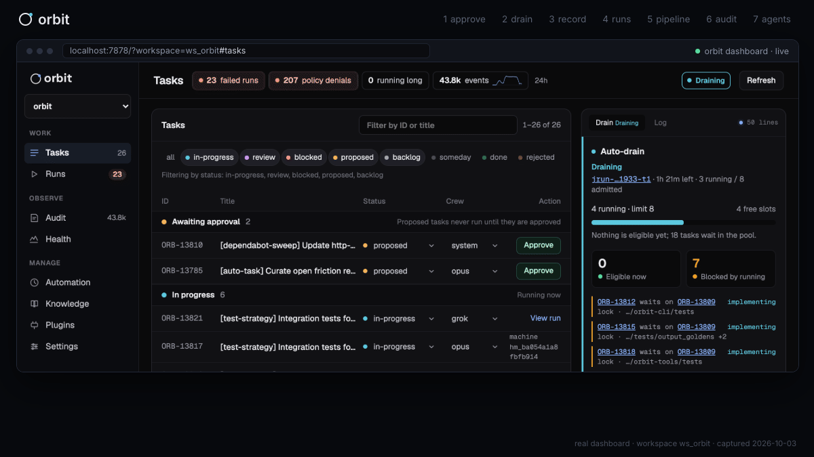

<p align="center">
  <a href="https://orbit-cli.com">
    <picture>
      <source media="(prefers-color-scheme: dark)" srcset="docs/assets/orbit-lockup-on-dark.svg" />
      
    </picture>
  </a>
</p>

<h3 align="center">Agents write. Orbit delivers.</h3>

<p align="center">
  <a href="https://github.com/constellation-works/orbit/releases"></a>
  <a href="https://www.npmjs.com/package/@orbit-tools/cli"></a>
  <a href="LICENSE.md"></a>
  <a href="https://orbit-cli.com"></a>
</p>

<p align="center">
  
</p>

Orbit is a local-first runtime for coding agents. Keep using your authenticated agent CLI; Orbit adds a durable task queue, sandboxed worktrees, file locks for parallel runs, a gated delivery pipeline, and an audit log.

**Why:** fast agents make planning, review, and traceability easy to lose. Orbit keeps the prompt, plan, and review behind every change, with a task ID on every workflow commit.

- **Single binary, no cloud.** State lives in `~/.orbit` and `.orbit/`; Orbit sends no telemetry.
- **Bring your own agents.** Use the provider CLIs you already have authenticated, without giving Orbit API keys.
- **MIT licensed.** No paid tier or hosted offering.

## How it works

```text
You:    The fsProfile lookup is undocumented. Get that fixed.
Agent:  Files a proposed task with acceptance criteria. Approve it and ship?
You:    Yes.
Agent:  Queues it, then runs plan → execute → review in a locked, isolated worktree.
        Opens a pull request. Review and merge it, then approve the task to close it.
```

Nothing starts without approval; PR runs stop for your review unless you authorize `--complete`. The task record keeps the prompt, plan, execution trace, and review. For larger specs, ask your agent to orchestrate: the bundled `orbit-orchestrate` skill splits the work, queues it once approved, runs it in parallel, and diagnoses failures ([delivery workflows](https://orbit-cli.com/getting-started/workflows/)).

## Quick start

**You need:** macOS or Linux (x64 or arm64; Windows uses [WSL2](docs/runbooks/windows-wsl2.md)), Node 18+, an authenticated agent CLI, and authenticated `gh` for pull requests.

```bash
npm install -g @orbit-tools/cli
orbit init    # machine name, task-ID prefix, agent skills, and Linux sandbox setup
```

Open your agent in the repo and ask it to **“set up Orbit for this repo”**. The bundled `orbit-setup` skill registers it, connects MCP, runs `orbit doctor`, and asks for choices such as the PR target branch. Start a fresh agent session, then ask: **“Add a hello.txt file containing hello; file it as an Orbit task.”** Approve and ship the task when prompted, review and merge the PR, then approve the task to close it. Watch with `orbit web serve`.

Prefer a plugin? [Install Orbit for Claude Code, Codex, or Cursor](https://orbit-cli.com/getting-started/install/#install-as-an-agent-plugin). Every MCP tool has a CLI twin; for the same loop without an agent, see [your first task from the terminal](https://orbit-cli.com/getting-started/first-task/#from-the-terminal).

<details>
<summary>Set up the repo by hand</summary>

```bash
cd <repo> && orbit workspace init --mcp    # add --ship-mode local to skip PRs
orbit doctor
orbit web serve
```

Review and commit the checkout files listed by `workspace init`, including MCP client files, before the first ship. Local delivery refuses tracked changes, merge conflicts, and untracked paths overlapping incoming changes.

`orbit doctor` checks CLI presence for default, system, and complexity-routed crews and warns when no MCP client is registered; it does not check provider sign-in or MCP connectivity. Use `orbit doctor providers` for all executor definitions. See [Linux sandbox readiness and distro coverage](docs/runbooks/linux-sandbox.md).

</details>

| To… | Run |
|---|---|
| Inspect a task or run | `orbit task show <ID>` · `orbit run show <RUN_ID>` |
| Open the dashboard | `orbit web serve` (remote: `orbit web connect <host>`) |
| Pick the default crew (provider and model) | `orbit config set workflow.default_crew <crew>` |
| Route tasks to crews by complexity | `orbit config set --global workflow.hard_complexity_crews '["opus"]'` ([more](#crews-and-complexity-routing)) |
| Upgrade | `npm install -g @orbit-tools/cli@latest` (`orbit update --check` shows what's new) |

## Features

- [Plan and govern](https://orbit-cli.com/concepts/#plan-and-govern): durable tasks, audit records, friction, and local search.
- [Execute safely in parallel](https://orbit-cli.com/concepts/#execute-safely-in-parallel): sandboxes, locks, gated pipelines, and nine agent CLIs.
- [Run unattended](https://orbit-cli.com/concepts/#run-unattended): bounded drains, optional completion, recurring reviews, and multiple machines.
- [Observe and extend](https://orbit-cli.com/concepts/#observe-and-extend): dashboard, plugins, and bundled agent skills.

## Crews and complexity routing

Crews name a provider, model, and effort level; complexity pools choose one for a task without an explicit crew. See [crew definitions](docs/CONFIG.md#crewsname--which-provider-model-runs-the-task), [init's seeded pools](docs/CONFIG.md#what-orbit-init-seeds), and [complexity routing, weighting, and overrides](docs/CONFIG.md#automatic-crew-pools-by-complexity).

## MCP and authority

[Connect your agent](https://orbit-cli.com/how-to/mcp-integration/#connect) explains operator and agent-only authority; [federated MCP](https://orbit-cli.com/how-to/mcp-integration/#register-the-federated-mux) connects multiple machines.

## Where state lives

[Scoping rules](https://orbit-cli.com/reference/scoping/#where-state-lives) explain machine and workspace state. See the [runbooks](docs/INDEX.md#runbooks) for backups, recovery, and upgrades.

## Learn more

- **[orbit-cli.com](https://orbit-cli.com):** guides, concepts, and the full CLI and config reference
- **[docs/CONFIG.md](docs/CONFIG.md):** crews, pools, base branch, sandbox
- **[docs/POSITIONING.md](docs/POSITIONING.md):** what Orbit is for, and what it deliberately isn't
- **[ARCHITECTURE.md](ARCHITECTURE.md)** and **[design docs](docs/INDEX.md#designs)**
- **[CHANGELOG.md](CHANGELOG.md):** Orbit is pre-1.0, and breaking changes ship in minor releases

## Contributing

Pull requests are welcome, from typo fixes to new executors. Small fixes can go straight to a PR; bigger changes start with an issue. See [CONTRIBUTING.md](CONTRIBUTING.md).

## License

[MIT](LICENSE.md)
