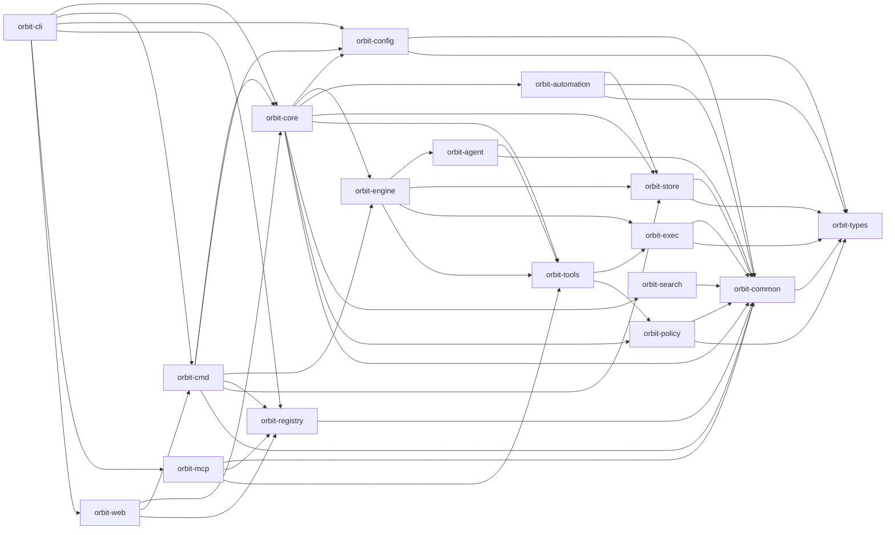

## Crates

| Crate | Responsibility |
|-------|----------------|
| `orbit-cli` | Clap-based entrypoint that composes Core, Registry, MCP, and Web. |
| `orbit-cmd` | CLI-facing command layer extracted from `orbit-core`: doctor, migrate, diagnostics, hooks, agent-rules, direct v2 activity runs. Exposes `*Commands` extension traits over `OrbitRuntime`. |
| `orbit-core` | Neutral runtime bootstrap, default asset seeding, and runtime-integrated command modules. Surfaces `OrbitRuntime` to `orbit-cmd`, `orbit-cli`, and `orbit-web`. |
| `orbit-config` | Owner of `config.toml`: fixed-key admission registry, global-over-workspace layering, source provenance, resolved views, comment-preserving edits, and default-config seeding. Depends only on `orbit-types` and `orbit-common`. |
| `orbit-automation` | Scheduling domain for routines and auto-tasks: definition discovery and validation, due evaluation, overlap/retry coordination, and the shared before-PR review coverage rules. Depends only on `orbit-store`, `orbit-common`, and `orbit-types`. |
| `orbit-registry` | Local machine identity and logical workspace catalog validation with atomic file persistence. |
| `orbit-web` | HTTP API, embedded dashboard UI, dashboard mutations, and SSH web connection over Core and Registry. |
| `orbit-engine` | Activity and job execution, template rendering, retry logic. Owns the CLI agent subprocess runner, which references `orbit-agent::{Agent, AgentConfig}` directly. |
| `orbit-agent` | Per-provider `AgentRuntime` implementations under `providers/<name>/<name>_runtime.rs` (claude, codex, copilot, cursor, gemini, antigravity, grok, ollama, opencode, pi, mock_agent), plus HTTP transports under `providers/{anthropic,gemini_http,openai_compat}/`. Also carries a standalone HTTP `LoopTransport` / `AgentLoop` SDK surface that Orbit's job execution no longer uses. |
| `orbit-tools` | Generic tool registry plus workspace-scoped builtins, filesystem tools, and policy-aware exec tools. |
| `orbit-policy` | Filesystem-scoping policy engine. Owns `FsProfile` resolution and `denyRead` / `denyModify` evaluation. |
| `orbit-exec` | Process / sandbox / supervision primitives for shell-command execution under an `FsProfile`. |
| `orbit-store` | Generic YAML/SQLite stores, connection primitives, namespaced feature-migration ledger, and immutable historical bootstrap migrations. Feature crates own their active schemas and queries. |
| `orbit-mcp` | RMCP framing, canonical discovery, server identity context, and direct SSH stdio proxy. |
| `orbit-search` | Workspace-local lexical task search: SQLite FTS5 chunks ranked by BM25, kept in sync as tasks change. |
| `orbit-types` | Lowest contract leaf — domain-qualified shared types (`identity`, `workspace`, `task`, `workflow`, `policy`, `resource`, `tool`, `telemetry`, `record`) and `OrbitId`. No I/O or Orbit crate deps. |
| `orbit-common` | Mechanism crate above `orbit-types` — `OrbitError`, governance, filesystem, process, storage, protocol, observability, and security helpers. |

## Dependency Direction

Arrows show the principal layering edges rather than every manifest edge. Do not add cross-crate dependencies that
violate this direction. Layering constrains dependency direction, not feature
ownership: focused feature crates own their domain data and transport behavior
while reusing neutral kernels. Lower layers stay reusable and never depend back
on the feature. In particular,
`orbit-core` must not depend on `orbit-agent` (the CLI agent subprocess runner
in `orbit-engine` is the bridge) and must never depend on `orbit-cmd`.
