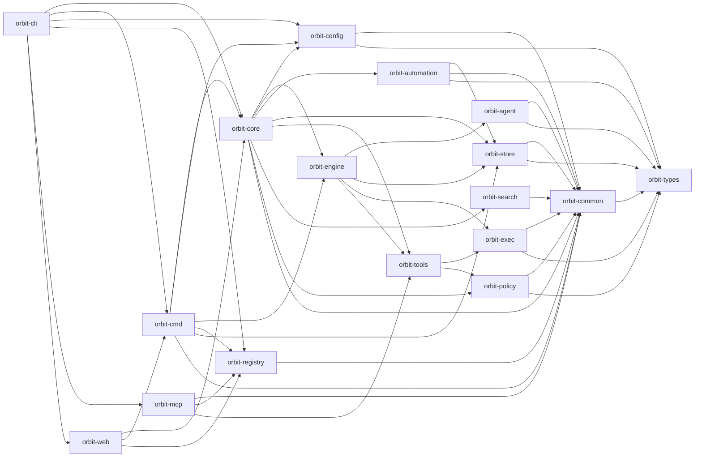

## Crates

| Crate | Responsibility |
|-------|----------------|
| `orbit-cli` | Clap entry point that composes Core, Cmd, Config, Registry, MCP, and Web. |
| `orbit-cmd` | CLI-facing command layer split out of `orbit-core`: doctor, migrate, diagnostics, hooks, agent rules, and direct v2 activity runs. Exposes `*Commands` extension traits over `OrbitRuntime`. |
| `orbit-core` | Runtime bootstrap, default asset seeding, and runtime-integrated command modules. Provides `OrbitRuntime` to `orbit-cmd`, `orbit-cli`, and `orbit-web`. |
| `orbit-config` | Owns `config.toml`: the fixed-key registry, workspace-over-global layering, source provenance, resolved views, comment-preserving edits, and default-config seeding. Depends only on `orbit-types` and `orbit-common`. |
| `orbit-automation` | Scheduling for routines and auto-tasks: definition discovery and validation, due evaluation, overlap and retry coordination, and the shared before-PR review coverage rules. Depends only on `orbit-store`, `orbit-common`, and `orbit-types`. |
| `orbit-registry` | This machine's identity and the logical workspace catalog, with validation and atomic file persistence. |
| `orbit-web` | HTTP API, embedded dashboard UI, dashboard mutations, and the SSH web connection, built on Core and Registry. |
| `orbit-engine` | Activity and job execution, template rendering, and retry. Owns the CLI agent subprocess runner, which uses `orbit-agent::{Agent, AgentConfig}` directly. |
| `orbit-agent` | Provider CLI runtimes under `providers/<name>/`, stdout projection and response helpers, and the audit types and redacted blob sinks persisted by `orbit-engine`. Depends only on `orbit-common` and `orbit-types`. |
| `orbit-tools` | Generic tool registry, workspace-scoped builtins, filesystem tools, and policy-aware exec tools. |
| `orbit-policy` | Filesystem-scoping policy engine: `FsProfile` resolution and `denyRead` / `denyModify` evaluation. |
| `orbit-exec` | Process, sandbox, and supervision primitives for running shell commands under an `FsProfile`. |
| `orbit-store` | Generic YAML and SQLite stores, connection primitives, the namespaced feature-migration ledger, and immutable historical bootstrap migrations. Feature crates own their active schemas and queries. |
| `orbit-mcp` | RMCP framing, canonical discovery, server identity context, and the direct SSH stdio proxy. |
| `orbit-search` | Workspace-local lexical task search: SQLite FTS5 chunks ranked by BM25, kept in sync as tasks change. |
| `orbit-types` | Lowest contract layer: shared types grouped by domain (`identity`, `workspace`, `task`, `workflow`, `policy`, `resource`, `tool`, `telemetry`, `record`, `plugin`, `desktop`) and `OrbitId`. No I/O and no Orbit crate dependencies. |
| `orbit-common` | Mechanism crate above `orbit-types`: `OrbitError` plus governance, filesystem, process, storage, protocol, observability, and security helpers. |

## Dependency direction

```mermaid
flowchart LR
  CLI["orbit-cli"] --> Core["orbit-core"]
  CLI --> Cmd["orbit-cmd"]
  CLI --> Config["orbit-config"]
  CLI --> Registry["orbit-registry"]
  CLI --> MCP["orbit-mcp"]
  CLI --> Web["orbit-web"]
  Cmd --> Core
  Cmd --> Config
  Cmd --> Engine
  Cmd --> Registry
  Cmd --> Store
  Core --> Config
  Core --> Engine["orbit-engine"]
  Core --> Automation["orbit-automation"]
  Automation --> Store
  Automation --> Common
  Automation --> Types
  Core --> Store["orbit-store"]
  Core --> Tools["orbit-tools"]
  Core --> Search["orbit-search"]
  Core --> Policy["orbit-policy"]
  Engine --> Agent["orbit-agent"]
  Engine --> Store
  Engine --> Exec["orbit-exec"]
  Engine --> Tools
  Tools --> Exec
  Tools --> Policy
  Exec --> Common["orbit-common"]
  Policy --> Common
  Store --> Common
  Agent --> Common
  Agent --> Types
  Search --> Common
  MCP --> Common
  MCP --> Registry
  MCP --> Tools
  Registry --> Common
  Web --> Core
  Web --> Cmd
  Web --> Registry
  Cmd --> Common
  Core --> Common
  Config --> Common
  Config --> Types
  Common --> Types["orbit-types"]
  Exec --> Types
  Policy --> Types
  Store --> Types
```

Arrows show the main layering edges, not every manifest edge. Don't add a
cross-crate dependency that points against this direction; `make ci-lint` checks
it. Layering constrains dependency direction, not feature ownership: a focused
feature crate owns its domain data and transport behavior while reusing neutral
kernels, and lower layers never depend back on the feature. In particular,
`orbit-core` must not depend on `orbit-agent` (the CLI agent subprocess runner
in `orbit-engine` is the bridge) and must never depend on `orbit-cmd`.
