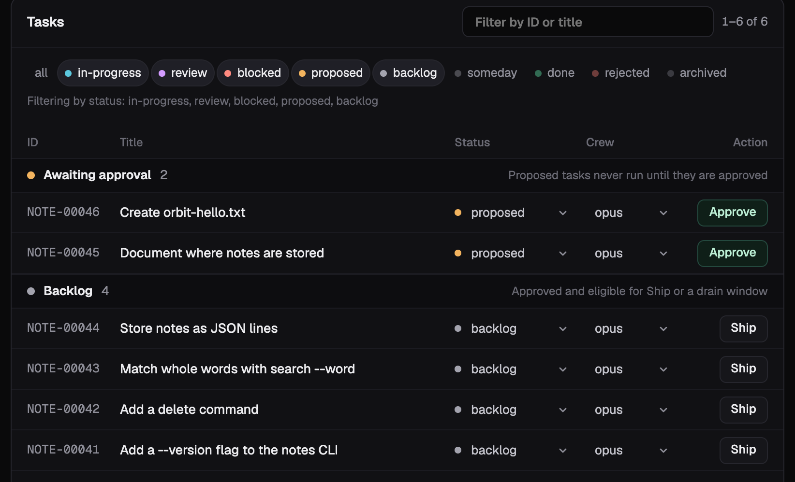
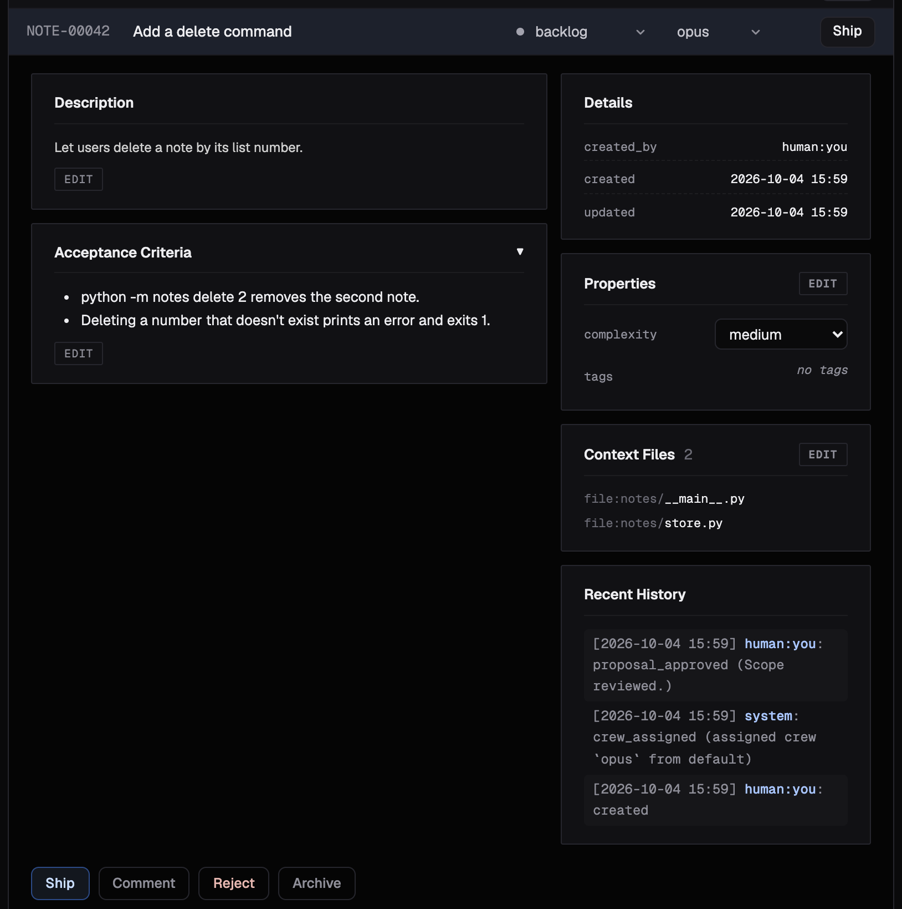

A task is Orbit's unit of work: a request with acceptance criteria that can be
run, checked, and traced. This page takes one task through its whole life:
your agent files it, you approve and ship it from the dashboard, and you
review what comes back.

## Before you start

Finish the [Quickstart](../) setup: Orbit connected to your agent in this
repository, and the dashboard open with `orbit web serve`. Use a repository
where a throwaway change is fine.

## 1. Ask for a change

Ask your agent for something small and checkable:

> Add orbit-hello.txt at the repository root containing "hello from orbit".
> File it as an Orbit task.

The agent files a task with a title, a complexity, and acceptance criteria.
The criteria are the finish line: the run checks its work against them. The
bundled `orbit` skill tells your agent how to write checkable criteria, so you
describe the outcome and it fills in the rest.

The task lands in `proposed`. Nothing runs yet.

## 2. Approve it

In the dashboard, the task appears in **Tasks** under **Awaiting approval**.
Open it, read the description and criteria, and click **Approve**. It moves to
`backlog`. If the task is wrong, click **reject**, or ask your agent to fix it
first.



You can also tell your agent to approve it. Either way, nothing reaches the
backlog without your approval.

## 3. Ship it

Click **Ship** on the task. Orbit reserves the files the task touches, gives it
an isolated worktree, and runs an agent in the sandbox to plan, execute, and
review the change. Click **View run** to follow each step live.



Asking your agent to ship it starts the same run. In the default `pr` ship
mode, the run ends by opening a pull request.

## 4. Review and close it

A successful run stops with the task in `review` and the pull request open.
The task's detail shows the plan and the execution summary, plus the
reviewer's verdict when second-agent review is on. **Runs** holds every step
and event behind them.

Review the pull request and merge it on GitHub. Then click **Approve** on the
task to move it from `review` to `done`.

If the run fails, its detail opens on the step it stopped at and the error it
recorded. Fix the cause, then click **Resume** to restart from that step. Or
ask your agent what went wrong: the `orbit-orchestrate` skill reads the run's
evidence and matches it to a known failure.

:::note[Two gates stay yours]
A new task waits in `proposed` until you approve it, and a ship run stops at
`review` with the pull request open. Merging the pull request and closing the
task are separate decisions, until you choose to
[let runs merge](../workflows/#completing-work-with---complete).
:::

## From the terminal

Every step has a CLI equivalent. The same task, end to end:

```bash
TASK_ID=$(orbit task add --title "Create orbit-hello.txt" \
  --acceptance-criteria "orbit-hello.txt exists at the repository root." \
  --acceptance-criteria "It contains the text 'hello from orbit'." \
  --complexity low --workspace .)
orbit task lint "$TASK_ID"               # flag vague criteria or unusable scope
orbit task update "$TASK_ID" --approve   # proposed → backlog
orbit run ship "$TASK_ID"                # prints a run ID and returns
orbit run show <RUN_ID>                  # follow the run
orbit task update "$TASK_ID" --approve   # after you merge: review → done
```

`orbit task add` prints only the new task ID. `--title` and `--complexity` are
required; `--context` narrows the work to the files that matter (see
[Choose Scopes](../../how-to/scoping-rules/)). `--approve` takes the next
approval step: `proposed` to `backlog`, then `review` to `done`.

- `orbit task show "$TASK_ID"` shows the task.
- `orbit audit list` shows the recorded events.
- `orbit task artifact put "$TASK_ID" <file>` attaches a report or other output
  to the task.

## Next

- [Delivery Workflows](../workflows/): ship many tasks at once, and let runs
  merge.
- [Use the Dashboard](../../how-to/dashboard/): everything the dashboard can
  do.
- [Run a Delivery Window](../../how-to/continuous-delivery/): drain a whole
  backlog.
