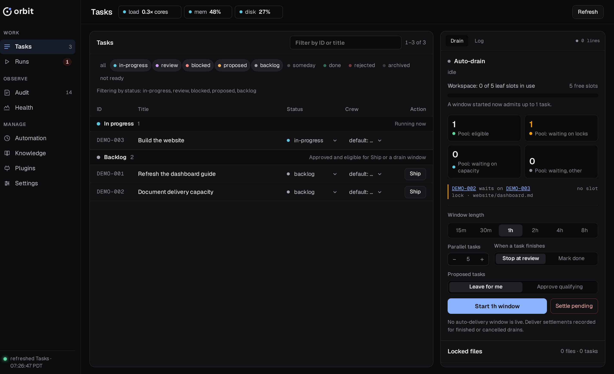

Every delivery runs the same gated pipeline: an isolated worktree, a lock on
the task's files, a sandboxed agent, then a pull request. You can start it from
three places, and they are interchangeable:

- **Your agent.** Ask in plain words. The `orbit-orchestrate` skill handles
  anything bigger than one task: filing, preparing, dispatching, and following
  up.
- **The dashboard.** Buttons for one task, and a drain card for a window.
- **The CLI.** `orbit run …`, for scripts and schedulers.

Runs are durable and asynchronous. Starting one returns a run ID at once, and
the run keeps going whether or not you watch.

## Hand a spec to your orchestrator

This is the shortest path from an idea to merged code. Give your agent the
outcome you want and ask it to orchestrate:

> Here's the spec for retry support in the sync client: … Break it into Orbit
> tasks, and once I approve them, ship them and merge what passes.

With the `orbit-orchestrate` skill, the agent:

1. Splits the spec into scoped tasks with acceptance criteria. They wait in
   `proposed`.
2. Prepares them: checks for duplicates, pins each task's files, and assigns
   crews.
3. Queues them in the backlog once you approve, in the dashboard or by telling
   it.
4. Starts a delivery window and follows it, diagnosing any run that fails and
   filing a repair task when the code needs one.

You come back to merged work and a record of every step. Pull requests merge
only when you ask; see [Completing work with `--complete`](#completing-work-with---complete).

## Ship one task

| From | Do |
|---|---|
| Dashboard | Click **Ship** on a backlog task in **Tasks**, then **View run**. |
| Agent | "Ship ABC-12." |
| CLI | `orbit run ship ABC-12` |

A ship run uses the workspace's ship mode:

- **`pr`** (the default) opens or updates a pull request and stops with the
  task in `review`.
- **`local`** commits and merges into the base branch before the task reaches
  `review`, so `review` is not a pre-merge stop.

Set the mode with `orbit workspace init --ship-mode`, or change it later with
`orbit workspace ship-mode pr|local`. On the CLI, `--mode` and `--base` override
it for one run.

PR mode needs a Git remote on a forge host. If no remote names a network host
(only a local bare repository, say), Orbit refuses to ship an untagged task
before creating a worktree, and `orbit doctor` warns on its `forge-remote` row.
Switch the workspace to `local`, or tag a single task
`delivery:task_local_pipeline` to deliver just that task locally.

## Drain the backlog

A drain keeps several tasks in flight for a set time and starts the next ready
task as each one finishes. Tasks that touch the same files wait their turn on
file locks.

| From | Do |
|---|---|
| Dashboard | In **Tasks**, open the **Drain** dock. Pick a window length and parallel tasks, then **Start**. |
| Agent | "Drain the backlog for four hours, eight at a time." |
| CLI | `orbit run auto --for 4h --concurrency 8` |



The window bounds only when new work starts; a task already running when it
closes still finishes. The drain card's **Eligible now** and **Blocked by
running** counts show what a window would start, and `orbit run readiness`
gives the same answer with reasons.
[Run a Delivery Window](../../how-to/continuous-delivery/) covers preparing
work, retuning, and stopping a window.

## Completing work with `--complete`

By default a run stops at `review`, and you close the task after merging. To
let a run finish delivery itself, authorize completion:

| From | Do |
|---|---|
| Dashboard | On the drain card, set **When a task finishes** to **Mark done** before **Start**. |
| Agent | Ask it to merge what passes. Over MCP only a drain can carry this authorization, so the agent starts one. |
| CLI | `orbit run auto --for 4h --complete`, or `orbit run ship ABC-12 --complete` |

With completion, a `pr` run merges its pull request through GitHub as soon as
branch protection allows. It never uses an administrative bypass, and the task
moves to `done` only after the merge is verified. A `local` run reaches `done`
only after it has committed, merged, and pushed. A closed or blocked pull
request, or a failed merge or push, fails the run and leaves the task in
`review`.

Local ship and auto runs require completion authorization on that run;
scheduled ship sweeps never complete tasks. For
[distributed handoffs](../../how-to/distributed-drain/), the owner can instead
set `workflow.distributed_completion = "done"` to authorize landing accepted
handoffs automatically. Its default, `"review"`, waits for **Approve handoff**
on the owner's dashboard. This setting applies to distributed handoffs, not
local ship or auto runs. Two limits on per-run completion:

- **A drain's completion covers its whole window**, including tasks that reach
  the backlog after it starts. It does not carry over to any other run.
- **It authorizes completion only.** It never approves `proposed` work into
  the backlog, and it does not stand in for a review verdict. The task's
  history records which run and operator authorized it.

## Watch and recover runs

The dashboard's **Runs** view lists every run, with **Live** and **Failed**
filters. A run's detail shows its steps, events, and timing; a failed run opens
on the step it stopped at and the error it recorded. From there you can
**cancel** a running run, **Resume** a failed one from its first unfinished
step, or **Replay run** to start it again.

Or ask your agent what happened. The `orbit-orchestrate` skill reads the run's
evidence, matches it to a known failure, and fixes the cause or files a repair
task instead of re-running blindly.

From the terminal:

```bash
orbit run history                      # recent runs
orbit run show "$RUN_ID"               # state and step summary
orbit run logs "$RUN_ID"               # raw output
orbit run cancel "$RUN_ID" --confirm   # stop it and release its locks
```

`orbit run events` and `orbit run trace` show a run's audit events and its tree
of child runs.

## More from the terminal

| Command | What it does |
|---|---|
| `orbit run task-pilot` | Prepare `proposed` and `backlog` tasks by pinning the files each one touches. Promotes and dispatches nothing. |
| `orbit run ship-sweep` | Start a ship run in every workspace with `[workflow] auto_ship = true` and ready work. Meant for a scheduler; never completes. |
| `orbit run job <job-id>` | Run any job definition directly. `--wait` blocks until it finishes. |

The [CLI reference](../../reference/cli/) lists every flag.
