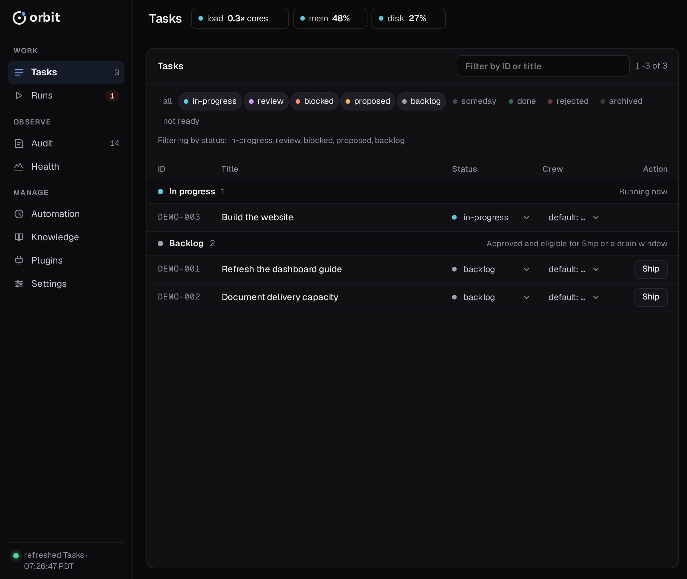
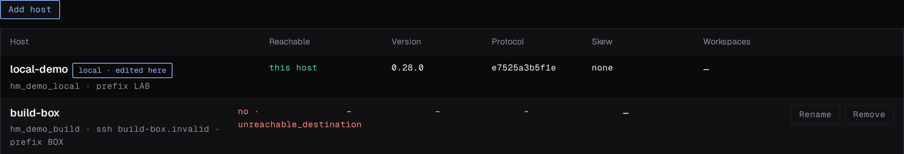

The Orbit dashboard is the browser UI for the host it runs on: tasks, runs,
errors, automation, and settings. It has no login and binds to loopback only.
To use another machine's dashboard, tunnel to it over SSH.



## Open it locally

```bash
orbit web serve
```

This serves every workspace in the current Orbit registry at
`http://127.0.0.1:7878` and tries to open a browser.

| Option | Effect |
|---|---|
| `--no-open` | Do not open a browser. |
| `--port <N>` | Serve on another port. |
| `--workspace <SELECTOR>` | Open on this workspace: a registered name, `ws_*` ID, or checkout path. If nothing matches, the dashboard opens on **All workspaces**. |
| `--operator` | Enable operator controls without an interactive terminal. See [Authorization](#authorization). |
| `orbit --root <DIR> web serve` | Serve only the workspaces in `<DIR>/workspaces.json`, not `~/.orbit/workspaces.json`. |

`--global` is still accepted but does nothing. The server refuses
non-loopback addresses such as `--host 0.0.0.0`; use
[`orbit web connect`](#open-it-over-ssh) to reach another machine.

## Open it over SSH

```bash
orbit web connect my-server
```

`my-server` is anything `ssh` accepts: a hostname, `user@host`, or a
`~/.ssh/config` alias. The command:

1. Forwards a local loopback port to the remote dashboard port.
2. Attaches to a remote `orbit web serve` that is already running, or starts
   one with `--operator`.
3. Prints `http://localhost:<port>` and opens it in a browser.
4. On Ctrl-C, closes the tunnel. It stops the remote server only if it
   started it.

| Option | Effect |
|---|---|
| `--port <N>` | Local port. Default `7878`, or a free port if `7878` is busy. An explicit port that is busy fails. |
| `--remote-port <N>` | Remote dashboard port. Default `7878`. |
| `--workspace <SELECTOR>` | Open on this remote workspace. `connect` refuses `--root`. |
| `--no-operator` | Start the remote server without operator capability, so automation controls and settings writes stay read-only. |
| `--no-open` | Do not open a browser. |

`connect` cannot add operator capability to a server it did not start. If it
attaches to one running without it, it prints a notice. Restart that server
with `orbit web serve --operator`, or stop it and reconnect.

## Workspace scope

With more than one workspace registered, the left rail has a workspace picker.
The dashboard opens on the `--workspace` match, else the workspace containing
the current directory, else the first active workspace.

- **All workspaces** lists tasks from every served workspace. Automation, the
  auto-drain, settings, and other per-workspace panels are read-only there.
  Task actions still work on a row that names its owning workspace and are
  sent to that owner. A row without an owner stays read-only.
- Inactive workspaces show as `<name> (unavailable)` and cannot be selected.
- The URL holds the workspace and time window, so a reload or copied link
  opens the same view.
- **Health → Reliability** covers every workspace, whatever is selected.

Confirm the selected workspace before you act. A count or metric does not
prove that a particular task or run succeeded.

## Find your way around

| Rail | Shows |
|---|---|
| **Tasks** | Tasks, with the ones waiting on you first. The right dock holds the [auto-drain](#auto-drain) card and a live log. |
| **Runs** | Job runs, newest first, and run detail. |
| **Audit** | Recent events and a 24-hour summary. |
| **Health** | Incidents, errors, reliability, step metrics, and the scoreboard. |
| **Automation** | **Routines** (with the host scheduler clock), **Auto-tasks**, and **Jobs**. |
| **Knowledge** | Friction records. |
| **Plugins** | Installed plugins and the panels they add. |
| **Settings** | The workspace's `config.toml`. |

The top bar counts failed runs, policy denials, long-running runs, and audited
events in the selected window. Click a count to open the view behind it.

View URLs keep older section names: `#diagnostics/…` is Health,
`#operations/…` is Automation, and `#config/…` is Settings.

## Tasks

Search by ID or title, or filter by status. Press Enter on a full task ID to
open it even when the filter, page, or selected workspace hides it.

Tasks are grouped in the order you act on them: **Awaiting approval**
(`proposed`), review, blocked, in progress, then backlog. Each row carries the
action its group waits on: **Approve** on a proposed task, **Ship** on a
backlog task, and **View run** on a task in progress.

Open a task to see its detail and every action its status allows:

| Action | Shown for |
|---|---|
| **ship** | `backlog`. Runs the workspace's ship mode (`pr` or `local`). Disabled while a ship run for the task is in flight. |
| **approve** | `proposed` or `review`. |
| **reject** | `proposed`, `review`, or `backlog`. |
| **archive** | Any status except `archived`. |
| **comment** | Any status. |

The row's status and crew dropdowns are editable when a workspace is
selected, or in **All workspaces** for a row that names its owner. The status
list shows every status:

- Moves the [lifecycle table](../../concepts/tasks/#transition-rules) allows
  still ask for the evidence they need, such as a plan or completion summary.
- Every other status sits under **force (off-table)**, marked ⚠. Picking one
  asks for confirmation, then applies it as an operator override. This is the
  same as `orbit task update <id> --status <status> --force` and is recorded
  in task history as a `forced` event. Agents cannot force a status.

The right dock has two modes. **Drain** shows the [auto-drain](#auto-drain)
card and the files tasks currently lock. **Log** is a live `orbit.log` tail
you can filter to **all**, **err**, **deny**, or **warn**.

### Edit task metadata

Expand a row to edit these fields in place. Edits change the task record; they
do not dispatch work.

| Field | Where and how |
|---|---|
| **description** | Left column. **edit** opens a Markdown editor. |
| **acceptance criteria** | Left column, collapsed section. **edit**, then one criterion per line. |
| **complexity** | **properties** card. Pick **low**, **medium**, **hard**, or **xhard**; it saves on change. A stored **unassessed** is shown but cannot be picked. |
| **tags** | **edit** in the **properties** card header. Separate tags with commas or newlines. |
| **context files** | **context files** section. **edit**, then one selector per line: `file:…`, `dir:…`, or `symbol:…`. |

Text fields save with **save** and discard with **cancel**. A failed save
keeps your draft open with the error.

For context files, the server checks that the file or directory exists and is
the kind the selector names. It does not look up `symbol:` names. If the task
will create the target, check **allow missing context** before you save.

### Distributed tasks

On the owner of a [distributed drain](../distributed-drain/), a task with an
execution claim shows a **distributed execution** panel with the claim's
state and the accepted handoff.

- **approve** on a `review` task with a handed-off claim sends **Approve
  handoff** for the exact candidate shown.
- **Revoke authority** and **Recover claim → blocked** / **Recover claim →
  backlog** require a reason. With the field empty, they send nothing.
- A replica shows the claim as held by its owner and refuses all three
  actions.

## Auto-drain

The auto-drain card starts and stops a
[delivery window](../continuous-delivery/): a time-bounded run that ships
approved backlog tasks in parallel. It sits at the top of the Tasks dock's
**Drain** mode; `#auto-drain` and `#operations/auto-drain` open it. It needs a
single active workspace.


The card shows:

- **State.** **Draining**, with time left and `N running / M admitted`;
  **Winding down · N workers still running** once admissions stop; or `idle`.
  The header links the live window's run. Windows started from the CLI show
  here too.
- **Capacity.** Running tasks against the limit, free slots, and what a window
  started now would admit.
- **Eligible now** and **Blocked by running.** Counts from a read-only
  readiness snapshot. Up to three blocked tasks are listed as
  `ABC-1 waits on ABC-2`, with the lock they contend for.

| Control | Effect |
|---|---|
| **Window length** | `15m` to `8h`. |
| **Parallel tasks** | How many tasks run at once. Blank uses the runtime default (5). Anything but a whole number of 1 or more disables **Start**. |
| **When a task finishes** | **Stop at review** (default) leaves shipped tasks in `review`. **Mark done** moves every task the window ships from `review` to `done`, not only those eligible now. **Mark done** needs an operator session. |
| **Proposed tasks** | **Leave for me** (default) leaves `proposed` tasks for you. **Approve qualifying** (`--approve-proposed`) lets every pass approve proposed tasks that have context files and an assessed complexity (or the `no-diff-expected` tag) and a clean task-pilot verification, including tasks filed while the window runs; `no-auto-approve` tasks are skipped. It needs an operator session and is disabled on a replica, where only the owner approves work. A live window started with it shows **Approving proposed tasks** with its approved and held counts. |
| **Start … window** | After a confirmation, runs `orbit run auto` with these settings. Reads **Start another … window** while one is draining. |
| **Stop** | Stops new admissions (`orbit run auto --stop`). Admitted workers keep running; this is not cancellation. Needs an operator session. |
| **Settle pending** | Replaces **Stop** when no window is admitting. Delivers pull settlements this replica recorded but has not yet delivered to its owner. Needs an operator session. |

Without operator capability you can still start a window that stops at
review; **Mark done** and **Approve qualifying** stay disabled and say why. Nothing is reserved or
started until you click **Start**. Results appear in the card's status line.

On a replica, a live pull drain counts as a window. The header reads **Pull
drain**, and the **Stop** confirmation says admitted leaves stay claimed by
their owner and that cancelling one fails its claim. See
[Set Up a Distributed Drain](../distributed-drain/#stop-cancel-and-settle).

## Runs and errors

**Runs** lists job runs for the selected workspace. Filter by **All**,
**Live**, or **Failed**. Click a run for its metadata, steps, events, child
runs, and a timing chart when one is recorded. A failed, timed-out, or
interrupted run opens on the step it stopped at and the error it recorded.

| Action | Available for | Effect |
|---|---|---|
| **cancel** | `pending` or `running` | Cancels the run. |
| **Resume** | `failed`, `interrupted`, or `timeout` | Restarts from the first step that did not succeed. A run authorized to mark tasks done requires an operator session to resume. |
| **Replay run** | Any run (asks first if it is still running) | Submits a new run of the same job. |

A refused action shows its error above the list until you dismiss it or start
another action. If the action succeeded but the view could not refresh, the
message says the view is stale. A `409` from ship or another start means a
conflicting run or workspace claim is held: refresh and open the named run
instead of retrying.

On a distributed-drain follower, cancelling a run that works a claimed task
asks first: it fails the claim on the owner and blocks the owner's task, which
the confirmation names. The run detail shows the claim (`pull_claim`), and a
pull drain's detail lists the crews its window can run and those it excluded,
with the reason.

Three failure counts answer different questions:

| Where | Counts |
|---|---|
| Top-bar **failed runs** | Job runs that failed, timed out, or were interrupted in the selected window. |
| Runs **Failed** filter | Runs in the `Failed` state, with no time window. |
| **Health → Errors** | Step and event failures this month. |

From a terminal, the same facts come from `orbit task show <task-id>`,
`orbit run show <run-id>`, and `orbit audit list`.

The Audit **Failure categories**, **Unexpected Failures by Callable Tool**,
and **Lifecycle diagnostics** views, plus the Health scoreboard, use the capped
incident scan. When the scan reaches its limit, each view marks its counts as
**capped** and shows partial coverage. These counts cover only the newest
non-success audit rows in the selected window; older failures and affected runs
may be omitted. Per-tool unexpected-failure rates use the scanned failure
counts with successful-call counts from the full window, so rates may be
understated. A zero in the scoreboard means no incidents in that scanned
sample. Total audited events and raw tool-call counts still cover the full
window.

## Automation

**Automation** has three views: **Routines** (with the host scheduler clock),
**Auto-tasks**, and **Jobs**. Its controls need a single active workspace and
an [operator session](#authorization). In **All workspaces** they are
read-only and say why. For what routines and auto-tasks are, see
[Schedule Recurring Work](../recurring-work/).

Each row shows the item, its trigger, when it fires next, its last result, and
one control. Rows are grouped by whether they will fire. **Details** expands
the longer fields.

### Routines


A **Next hour** strip shows each routine due in the next hour: solid if it
will fire, hollow if it is paused. A paused routine's slot is skipped, not
queued. An enabled routine that cannot take effect shows a **blocked** pill.

Each row's switch writes the routine's `enabled` field. It does not start or
stop the host scheduler clock.

### Scheduler clock

The bar above the routines shows this host's scheduler clock (`orbit clock tick`):
health, provider, whether the service is enabled, cadence, and the last and
next tick.

- **Pause clock** / **Enable clock** asks for confirmation. It does not change
  any routine definition.
- The cadence picker and **Apply cadence** change the interval without pausing
  or enabling the clock.

The CLI equivalents are `orbit clock status`, `orbit clock pause`,
`orbit clock enable`, and `orbit clock set --cadence-seconds <N>`.

### Auto-tasks

Definitions live in `.orbit/auto_tasks/` and are checked on every scheduler clock
tick, so pausing the clock pauses scheduled mints. Rows are grouped **On a
schedule**, **On delivery** (minted after landed deliveries), and
**Disabled**. The stats strip counts definitions with an open duplicate, and
the scheduler skips those slots; the row calls out the duplicate too.

- The switch writes the definition's `enabled` field after a confirmation. A
  disabled definition is skipped, not deleted.
- **Mint now** creates one task immediately. It ignores the schedule, the
  enabled flag, and dedupe, so it works on a disabled definition and creates
  another task even when one is open. The confirmation warns about this.
  `orbit auto-task mint <name>` does the same.

### Jobs

**Jobs** lists the jobs this workspace's routines target or recently ran,
with **Running now** above them. They are grouped **Sweeps** (housekeeping and
intake, safe to run by hand), **Delivery** (task and workspace pipelines), and
**Other**.

**Run ▸** starts the job in this workspace with no input and reports the new
run ID. It is disabled on **Delivery** rows, which need a task or a window:
use **ship** or the [auto-drain](#auto-drain). **Details** shows the
equivalent command, such as
`orbit run job worktree_gc_pipeline --workspace orbit`.

## Settings

**Settings** shows the configuration this workspace runs on, with the same
layering and descriptions as `orbit config show`.

| View | Shows |
|---|---|
| **Effective** | The merged result: workspace values over global values over built-in defaults. |
| **Workspace file** | `.orbit/config.toml` alone (`orbit config show --scope workspace`). |
| **Global file** | `~/.orbit/config.toml` alone. Edits here write the global file. |
| **Crews** | The crew table. |
| **Keys** | Every settable key with its type, section, description, and accepted values. |
| **Hosts** | This serving machine's local identity and registered SSH hosts, independent of the workspace selection. |

**Effective** opens with a strip naming both files, then one panel per section
(Delivery, Crews, Execution, Review, Housekeeping) and a read-only **Paths**
grid. Each row shows the value, where it came from, and the key's description.
The source is `workspace`, `global`, `default` (no file sets it), `unset` (no
value at all), or `registry` (from the workspace registry, not
`config.toml`).

Rows also flag two things the value alone hides:

- `overrides global: trunk`: the workspace file replaced a global value.
- `global sets … — not inherited while a workspace file exists`: a workspace
  `config.toml` must restate the security keys `execution.codex.sandbox`,
  `execution.codex.approval_policy`, and `execution.env.pass` to keep them.
  The Execution panel shows a badge, and the strip warns whenever a workspace
  file exists.

**Set only** hides keys nothing sets, except rows that override or drop a
lower layer. **All keys** shows the rest.

A **registry strip** shows the registered `base_branch` and `ship_mode`.
Delivery uses these, not `workflow.base_branch`, and the strip flags a
disagreement. Change them with `orbit workspace`; the strip is read-only.

### Edit a value

Click a row, or its pencil, to edit it. The editor matches the key's type: a
choice list, toggle, number field, or chip list. Each row saves on its own.

- In **Effective**, saves go to the workspace file (`.orbit/config.toml`,
  per-user and git-ignored). Only **Global file** writes `~/.orbit/config.toml`.
- A save passes the same checks as `orbit config set`. A refused value shows
  that command's message on the row.
- If the workspace has no `config.toml` yet, the first save is refused,
  because creating the file moves the security keys off global policy. The row
  offers **Copy global policy** (`--seed-from-global`) or **Start empty**
  (`--fresh`).
- Writes need an operator session. Each records a `config.set` audit event
  with the key, the old and new values, and the file. Without the capability,
  rows are read-only.

**Crews** shows one row per crew with its provider, model, effort, tags, and
source layer. The crews named by `workflow.default_crew` and
`workflow.system_crew` are marked. You can add, edit, and delete crews inline,
with two refusals:

- You cannot delete a crew that either key still names.
- A file that defines any `[crews.*]` table must resolve
  `workflow.default_crew` within itself, so adding the first crew to a file
  with no default crew is refused.

Routines, auto-task definitions, and the workspace registry are not editable
here. Workspace settings show one workspace at a time; **Hosts** also works
in **All workspaces**.

### Hosts

Open **Settings › Hosts** (`#config/hosts`) to manage the serving machine's
[`hosts.toml`](../../reference/config/#host-registry). Through
`orbit web connect`, this is the remote machine's registry.



Captured from Orbit 0.28.0 on 2026-10-08 with an isolated demo registry.
`build-box.invalid` is an intentionally unreachable example SSH target.

The local host comes first, labelled **local · edited here**. Remote rows
show their SSH target, task prefix, reachability, Orbit version, protocol,
skew, and workspace roles. An unreachable host stays visible with its typed
error. Opening the view and **Reload** probe every host. Periodic refreshes
reread the file and retain the last probe results; they open no background
SSH sessions. A CLI-added host appears on the next refresh.

- **Add host** opens an inline form for an SSH target and an optional name.
  Saving probes the host and registers its identity here, as `orbit host add`
  does. It writes nothing on the remote.
- **Rename** edits the local entry name; the machine ID and SSH route stay
  the same.
- **Remove** asks for confirmation inline. A `host_in_use` refusal lists
  dependent replica checkouts and pull drains and offers a separate force
  confirmation, which removes their route.

Edits need an [operator session](#authorization). Without one, this view is
read-only. The local host cannot be removed or renamed here. If a newer
host file fails validation, a banner shows the error and the last valid
snapshot stays visible until you repair the file. Mutations always validate
the current file.

For host setup and typed errors, see [Run Orbit across hosts](../multi-host/).

## Authorization

The dashboard has **no login** and binds loopback only. Origin checks reduce
browser CSRF but do not control access. Anyone who can reach the port,
including a forwarded port, can call the same write endpoints the browser uses,
with the server process's authority. Keep that port inside your operator
boundary.

Two gates apply:

1. **Workspace scope.** **All workspaces** and inactive workspaces are
   read-only, even for an operator. The exception is task actions on rows that
   name their owner, and the machine-global **Settings › Hosts** view.
2. **Operator capability.** Needed for routine and auto-task switches,
   **Mint now**, **Run ▸**, clock controls, **Mark done**, **Stop** and
   **Settle pending**, settings writes, plugin enable and disable, and the
   owner's handoff approve, revoke, and claim-recovery actions.

The dashboard server has operator capability when:

- it was started from a local interactive terminal;
- it was started with `orbit web serve --operator`;
- it was started by `orbit web connect`, which passes `--operator` by default
  because the SSH login is the operator act (pass `--no-operator` for a
  read-only remote); or
- its process has `ORBIT_OPERATOR=1`, which the audit trail records.

MCP is separate: `orbit mcp serve --operator` is its only operator path.

An unauthorized control is disabled and shows the reason, and the panel says
how to get operator access. A request that reaches the API anyway gets `403`
with `code: authorization_denied`.

Task **ship**, **approve**, **reject**, and **archive**, plus run **cancel**
and review-only **Resume**, do not need operator capability. They need a
concrete active workspace, and they fail closed on conflicts such as an
in-flight ship or a held workspace claim.

**Resume** keeps the source run's completion policy. If that policy marks
tasks done, resuming requires operator capability and otherwise returns
`403` with `code: authorization_denied` and `operation: auto_drain.complete`.
Starting a window with `approve_proposed` set without operator capability
returns the same `403` with `operation: auto_drain.approve_proposed`.
**Replay run** requires operator capability for any source run.

## Troubleshooting

| Symptom | What to check |
|---|---|
| No browser, or `connection refused` | Is `orbit web serve` still running? `curl -s http://127.0.0.1:7878/healthz` returns `ok` from a live server. |
| `refusing to bind dashboard to non-loopback address` | Bind `127.0.0.1` or `::1`. Reach another machine with `orbit web connect`. |
| `orbit web connect does not accept --root` | Pass `--workspace <SELECTOR>`. |
| Connect waits, then fails readiness | SSH must work without prompts, and `orbit` must be on the remote `PATH`. The remote server has about 30 seconds to answer `/healthz`. |
| Automation buttons disabled | Select one active workspace. If the reason mentions operator authority, see [Authorization](#authorization). `connect` cannot upgrade a remote server it did not start. |
| Ship returns `409` `ship_run_in_flight` | The task already has an unfinished ship run. Open the named `run_id`. |
| `409` `workspace_claim_held` | Another operator holds the workspace claim. Wait for it to expire or inspect the holder; do not retry in a loop. |
| Top-bar **failed runs** disagrees with **Health → Errors** | They count different things. See [Runs and errors](#runs-and-errors). |
| Settings save says "no workspace config exists yet" | Expected on the first write. Choose **Copy global policy** or **Start empty**. |
| Settings save returns an admission error | `orbit config set` refuses the value too. The message lists the accepted values. |
| New workspace missing after `orbit workspace init` | Click **Refresh**. The server reloads `workspaces.json` when it changes, and keeps the last good list if the file is malformed. |
| **connecting…** stays orange after startup | The first API request probably failed. **Refresh** or the `/healthz` probe tells a dead process from a slow workspace. |

For uptime monitoring, use the detailed probe. It also checks each workspace's
store and log sink:

```bash
curl -s 'http://127.0.0.1:7878/healthz?detailed=true'
```

It returns `200` when every check passes and `503` when any fails. Plain
`/healthz` checks liveness only.

## Next

- [First Task](../../getting-started/first-task/): take one task from your
  agent's request to a reviewed pull request.
- [Schedule Recurring Work](../recurring-work/): routines, the host scheduler clock,
  and auto-task definitions.
- [Run a Delivery Window](../continuous-delivery/): prepare, start, stop, and
  recover a bounded drain.
- [Connect Your Agent](../mcp-integration/): the tool surface agents use,
  separate from this operator UI.
