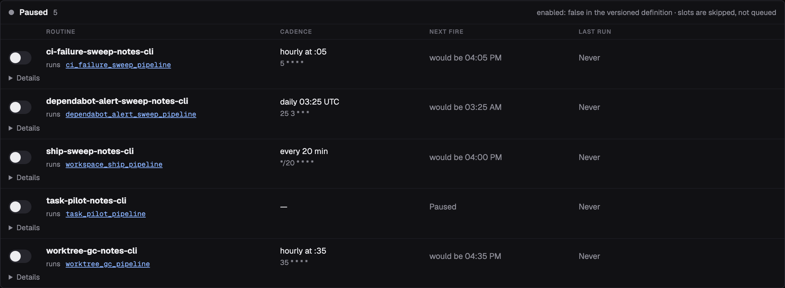

A per-machine **host scheduler clock** drives all scheduled work. On each tick, due
**routines** start job runs and due **auto-tasks** file tasks. Every routine
and auto-task Orbit seeds starts disabled. [Routines and Auto-Tasks](../../concepts/scheduling/) explains
the model; this page is the procedure.

:::tip[Let your agent set it up]
Ask your agent to **install the Orbit clock and turn on worktree GC**, or to
**file a dependency audit every Monday**. The `orbit-setup` skill installs the
clock and enables the routines and auto-tasks you ask for. After that, the
dashboard's **Automation** view toggles routines and auto-tasks, pauses,
enables, or retunes the clock, and has **Mint now** for any auto-task; see
[Use the Dashboard](../dashboard/). The commands below are the fallback.
:::

## 1. Install the clock

```bash
orbit routine init --install-clock
```

This installs a per-user unit (launchd on macOS, a systemd user timer on
Linux) that runs `orbit clock tick` every minute. Each tick reads routines and
auto-tasks from every registered owner checkout on this machine. Nothing is
scheduled until the clock runs.

```bash
orbit clock status
orbit clock pause                       # stop scheduled ticks
orbit clock enable
orbit clock set --cadence-seconds 300   # whole minutes only
```

A paused clock still allows a manual `orbit clock tick`, and pausing it leaves
each routine's own pause state alone.

The unit runs Orbit by absolute path. If that binary moves or is removed,
ticks stop while `orbit clock status` can still report the clock as enabled.
`orbit update` repairs the unit; run `orbit clock repair` after installing
Orbit some other way. Repair never resumes a clock you paused.

To try a change, run a tick by hand:

```bash
orbit clock tick --dry-run --verbose     # what would fire; writes nothing
orbit --workspace <name> clock tick      # only that workspace's schedules
```

## 2. Turn on routines

`orbit workspace init` seeds five routines into `.orbit/routines/`, all
disabled: task pilot, ship sweep, worktree GC, and the CI-failure and
dependency-alert sweeps. `orbit workspace sync` refreshes them after an
upgrade and keeps your edits.

Turn one on with its switch in **Automation → Routines**, or set
`enabled: true` in its YAML. Git ignores `.orbit/`, so the change applies to
this checkout on this machine. Start with worktree GC, and turn on the ship
sweep last (see [Ship unattended](#ship-unattended)).



```bash
orbit routine list            # enabled, paused, next due, last fire
orbit routine show <name>
```

### Write a routine

```yaml
schemaVersion: 1
name: ship_sweep_myrepo
description: Ship this workspace's ready backlog through the gated pipeline.
enabled: true
trigger:
  cron: "*/30 * * * *"  # 5-field cron, host-local time
  missed_run: skip      # or catch_up_once
target: job:workspace_ship_pipeline
policy:
  timeout_minutes: 120
  overlap: forbid       # or allow
  retries:
    max: 0
    backoff_minutes: 15
```

- **`target`** must be a job (`job:<name>`). To schedule one activity, wrap it
  in a one-step job.
- **`missed_run`** handles slots missed while the machine slept. `skip`, the
  default, waits for the next slot. `catch_up_once` fires one make-up run.
- **`overlap: forbid`**, the default, skips a fire while the previous one is
  still running. After `timeout_minutes`, the stuck fire is recorded as timed
  out and stops blocking.
- **There is no host field.** Every machine with a registered owner checkout
  and its clock on evaluates the routine against its own store. To keep it
  off one machine, run `orbit routine pause <name>` there;
  `orbit routine resume <name>` undoes it. Pauses stay on that machine, are
  never synced, and survive reboots. To retire a routine, set
  `enabled: false`.

An invalid file never fires with defaults; Orbit skips it.

## 3. Define recurring chores as auto-tasks

An auto-task is a task template that the clock files on a schedule. A new
chore is a new definition, never new code or a new routine. The tick files
tasks itself, so there is no routine to enable.

```bash
orbit auto-task add \
  --name weekly-dep-audit \
  --cron "0 9 * * 1" \
  --title "Audit outdated dependencies" \
  --body "Check the lockfile for outdated or vulnerable dependencies and file follow-up work." \
  --criterion "Every outdated direct dependency is listed with its current and latest version." \
  --criterion "Anything with a known advisory has a filed follow-up task." \
  --tag maintenance
```

Give exactly one trigger: `--cron`, `--every-minutes`, or
`--deliveries-landed '<JSON>'`, which fires once verified deliveries land on a
branch. A cron or interval definition is enabled as soon as you add it. A
delivery-triggered one starts disabled; check it with
`orbit auto-task show <name> --preview` before you enable it.

| Option | Effect |
|---|---|
| `--status` | Status of each filed task: `backlog` (default), or `proposed` to approve each one yourself. |
| `--dedupe` | `skip-if-open` (default) skips a fire while the previous task is still open, so a stalled backlog never collects copies. `always` files regardless. |
| `--crew` | Crew for filed tasks. |
| `--priority` | `low`, `medium` (default), `high`, or `critical`. |
| `--tag` | Extra tag on each filed task, beside the `auto-task:<name>` tag. Repeatable. |
| `--required-tools` | Exact canonical tool names copied to each filed task. |

### Mint one now

```bash
orbit auto-task mint weekly-dep-audit
```

This files one task immediately, like **Mint now** in the dashboard. It
ignores the schedule, the dedupe policy, and `enabled`, and it does not move
the next scheduled fire. Use it to see what a definition produces before you
leave it running.

### Change, turn off, or delete

```bash
orbit auto-task list --enabled
orbit auto-task show weekly-dep-audit
orbit auto-task update weekly-dep-audit --cron "0 9 * * 2"   # only the fields you pass
orbit auto-task toggle weekly-dep-audit off                  # keeps the definition and its history
orbit auto-task delete weekly-dep-audit --reason "moved to Renovate"
```

`delete` removes the definition and its scheduler cursor, and writes an audit
record. It refuses while a task filed from the definition is still open and
names those tasks; `--force` deletes anyway and leaves them alone.

Deleting a shipped default, such as `code-review` in a repository with no
code, also records an opt-out: later `orbit workspace init --force` and
`orbit workspace sync` runs leave it out, and `orbit doctor` does not report it
missing. `orbit auto-task restore <name>` brings it back, disabled as shipped.

### Repair a delivery-triggered definition

A `--deliveries-landed` definition keeps a ledger of the deliveries it still
owes a review. `recover` and `reset` only preview until you pass `--reason`:

```bash
orbit auto-task recover <name> --adopt-settings --reason "<why>"   # resume after a settings change; keeps the debt
orbit auto-task recover <name> --replay-history --reason "<why>"   # reconcile a rebased branch; keeps the debt
orbit auto-task reset <name> --reason "<why>"                      # forget the debt; re-baseline at the branch head
orbit auto-task update <name> --waive-batch <batch-id> --waiver-reason "<why>"  # waive one settled failed batch
```

`recover --reissue-action` re-files a settled action that closed without
accepted evidence. `reset --force` abandons an executing action instead of
cancelling it. Deleting the definition runs the same audited reset, so
`delete` refuses whenever `reset` would. The
[auto-task reference](https://github.com/constellation-works/orbit/blob/main/plugin/skills/orbit-setup/references/auto-tasks.md)
covers stalls and the shipped definitions.

## 4. Watch it work

A routine fire is an ordinary run, and a filed task is an ordinary task. The
**Automation** view shows each routine's and auto-task's next fire and last
result; `orbit routine list` and `orbit auto-task list` show the same. Find
what got filed by its tag:

```bash
orbit task list --tag maintenance
```

Approve anything filed as `proposed`, then let a
[delivery window](../continuous-delivery/) pick it up.

## Ship unattended

To ship on a schedule, turn on the seeded ship-sweep routine. As seeded, it
runs every 30 minutes and ships this workspace's ready backlog through the
gated pipeline. It never grants `--complete`, so shipped work waits in
`review` for you. Turn on worktree GC first.

`orbit run ship-sweep` is the cross-workspace command for an external
scheduler. It ships only in workspaces with `workflow.auto_ship = true`, and
it never grants `--complete` either. That setting does not affect the
routine.

## If nothing fires

Check in this order:

1. The clock is enabled: `orbit clock status`.
2. This checkout is registered as an owner: `orbit workspace list`.
3. The definition has `enabled: true`.
4. The routine is not paused on this machine: `orbit routine list`.

`orbit clock tick --dry-run --verbose` shows the decision for every routine
and auto-task, and `orbit doctor` runs the host health checks. The
[CLI reference](../../reference/cli/#scheduler) lists every scheduler command.
